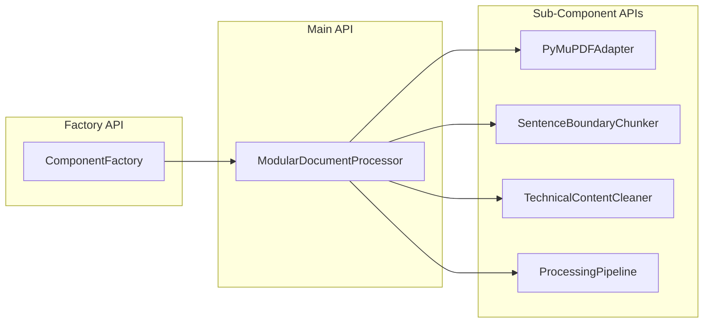

# Document Processor API Reference

**Version**: 1.0  
**Date**: 2025-07-10  
**Status**: Production Ready

---

## Table of Contents

1. [Overview](#overview)
2. [Quick Start](#quick-start)
3. [Main Classes](#main-classes)
4. [Sub-Component APIs](#sub-component-apis)
5. [Configuration Reference](#configuration-reference)
6. [Error Handling](#error-handling)
7. [Examples](#examples)
8. [Best Practices](#best-practices)

---

## Overview

The Document Processor API provides a modular, configurable interface for transforming raw documents into searchable chunks. It consists of a main processor coordinating specialized sub-components for parsing, chunking, and cleaning content.

### Architecture Overview



---

## Quick Start

### Basic Usage

```python
from src.core.component_factory import ComponentFactory
from pathlib import Path

# Create processor
processor = ComponentFactory.create_processor("hybrid_pdf")

# Process document
documents = processor.process(Path("document.pdf"))

# Get results
print(f"Generated {len(documents)} chunks")
for doc in documents:
    print(f"Chunk: {doc.content[:100]}...")
```

### With Custom Configuration

```python
# Create with legacy parameters (automatic conversion)
processor = ComponentFactory.create_processor(
    "hybrid_pdf",
    chunk_size=1024,
    chunk_overlap=128,
    preserve_layout=True
)

# Or with modern configuration
config = {
    'parser': {'type': 'pymupdf', 'config': {'preserve_layout': True}},
    'chunker': {'type': 'sentence_boundary', 'config': {'chunk_size': 1024}},
    'cleaner': {'type': 'technical', 'config': {'preserve_code_blocks': True}}
}

processor = ComponentFactory.create_processor("hybrid_pdf")
processor.configure(config)
```

---

## Main Classes

### ComponentFactory

Factory class for creating document processors with proper dependency injection.

#### Methods

##### `create_processor(processor_type: str, **kwargs) -> DocumentProcessor`

Creates a document processor instance.

**Parameters**:
- `processor_type` (str): Processor type ("hybrid_pdf", "modular", "legacy_pdf")
- `**kwargs`: Legacy parameters or configuration overrides

**Returns**: `DocumentProcessor` instance

**Raises**:
- `ValueError`: If processor type is not supported
- `TypeError`: If constructor arguments are invalid

**Example**:
```python
# Basic creation
processor = ComponentFactory.create_processor("hybrid_pdf")

# With legacy parameters
processor = ComponentFactory.create_processor(
    "hybrid_pdf",
    chunk_size=512,
    chunk_overlap=64
)

# With configuration
processor = ComponentFactory.create_processor(
    "hybrid_pdf",
    preserve_layout=True,
    quality_threshold=0.5
)
```

##### `get_available_components() -> Dict[str, List[str]]`

Returns all available component types and names.

**Returns**: Dictionary mapping component types to available names

**Example**:
```python
available = ComponentFactory.get_available_components()
print(f"Available processors: {available['processors']}")
# Output: ['hybrid_pdf', 'modular', 'pdf_processor', 'legacy_pdf']
```

##### `get_performance_metrics() -> Dict[str, Dict[str, Any]]`

Returns performance metrics for component creation.

**Returns**: Dictionary with creation metrics by component type

**Example**:
```python
metrics = ComponentFactory.get_performance_metrics()
for component, data in metrics.items():
    print(f"{component}: {data['creation_count']} created, "
          f"avg {data['average_time']:.4f}s")
```

---

### ModularDocumentProcessor

Main document processor implementing modular architecture with configurable sub-components.

#### Constructor

```python
ModularDocumentProcessor(
    config: Dict[str, Any] = None,
    chunk_size: int = None,
    chunk_overlap: int = None,
    **kwargs
)
```

**Parameters**:
- `config` (Dict[str, Any], optional): Complete configuration dictionary
- `chunk_size` (int, optional): Legacy chunk size parameter
- `chunk_overlap` (int, optional): Legacy chunk overlap parameter
- `**kwargs`: Additional legacy parameters

#### Methods

##### `process(file_path: Path) -> List[Document]`

Process a document through the complete pipeline.

**Parameters**:
- `file_path` (Path): Path to the document file

**Returns**: List of processed Document objects

**Raises**:
- `ValueError`: If file format is not supported
- `IOError`: If file cannot be read

**Example**:
```python
from pathlib import Path

documents = processor.process(Path("technical_manual.pdf"))
print(f"Processed into {len(documents)} chunks")

for doc in documents:
    print(f"Content length: {len(doc.content)}")
    print(f"Metadata: {doc.metadata}")
```

##### `supported_formats() -> List[str]`

Return list of supported file extensions.

**Returns**: List of supported file extensions

**Example**:
```python
formats = processor.supported_formats()
print(f"Supported formats: {formats}")
# Output: ['.pdf']
```

##### `validate_document(file_path: Path) -> ValidationResult`

Validate document before processing.

**Parameters**:
- `file_path` (Path): Path to the document file

**Returns**: ValidationResult with validation status and messages

**Example**:
```python
result = processor.validate_document(Path("document.pdf"))
if result.valid:
    print("Document is valid for processing")
else:
    print(f"Validation errors: {result.errors}")
    print(f"Warnings: {result.warnings}")
```

##### `configure(config: Dict[str, Any]) -> None`

Configure the processor with new settings.

**Parameters**:
- `config` (Dict[str, Any]): Configuration dictionary

**Raises**:
- `ValueError`: If configuration is invalid

**Example**:
```python
new_config = {
    'chunker': {
        'config': {
            'chunk_size': 2000,
            'overlap': 300
        }
    },
    'cleaner': {
        'config': {
            'detect_pii': True
        }
    }
}

processor.configure(new_config)
```

##### `get_config() -> Dict[str, Any]`

Get current configuration.

**Returns**: Current configuration dictionary

**Example**:
```python
config = processor.get_config()
print(f"Chunk size: {config['chunker']['config']['chunk_size']}")
print(f"Parser type: {config['parser']['type']}")
```

##### `get_metrics() -> Dict[str, Any]`

Get processing metrics.

**Returns**: Dictionary with processing metrics and statistics

**Example**:
```python
metrics = processor.get_metrics()
print(f"Documents processed: {metrics['documents_processed']}")
print(f"Total chunks created: {metrics['total_chunks_created']}")
print(f"Average processing speed: {metrics.get('average_processing_speed', 0)} bytes/sec")
print(f"Error rate: {metrics['errors_encountered']}")
```

##### `get_component_info() -> Dict[str, Any]`

Get information about active components.

**Returns**: Dictionary with component information

**Example**:
```python
info = processor.get_component_info()
print(f"Parser: {info['parser']['class']} ({info['parser']['type']})")
print(f"Chunker: {info['chunker']['class']} ({info['chunker']['type']})")
print(f"Cleaner: {info['cleaner']['class']} ({info['cleaner']['type']})")
print(f"Supported formats: {info['parser']['supported_formats']}")
```

---

## Sub-Component APIs

### PyMuPDFAdapter

Adapter for PyMuPDF library providing PDF parsing capabilities.

#### Methods

##### `parse(file_path: Path) -> Dict[str, Any]`

Parse PDF document and extract content.

**Parameters**:
- `file_path` (Path): Path to PDF file

**Returns**: Dictionary with parsed content and metadata

**Raises**:
- `ValueError`: If file is not a valid PDF
- `IOError`: If file cannot be read

**Example**:
```python
parsed = processor.parser.parse(Path("document.pdf"))
print(f"Text length: {len(parsed.get('text', ''))}")
print(f"Page count: {parsed.get('metadata', {}).get('pages', 0)}")
```

##### `extract_metadata(document: Dict[str, Any]) -> Dict[str, Any]`

Extract metadata from parsed document.

**Parameters**:
- `document` (Dict[str, Any]): Parsed document data

**Returns**: Dictionary with extracted metadata

**Example**:
```python
metadata = processor.parser.extract_metadata(parsed_doc)
print(f"Title: {metadata.get('title', 'Unknown')}")
print(f"Author: {metadata.get('author', 'Unknown')}")
print(f"Creation date: {metadata.get('creation_date', 'Unknown')}")
```

##### `supported_formats() -> List[str]`

Return supported file formats.

**Returns**: List of supported file extensions

---

### SentenceBoundaryChunker

Intelligent text chunker that preserves sentence boundaries.

#### Methods

##### `chunk(text: str, metadata: Dict[str, Any]) -> List[Chunk]`

Split text into semantic chunks preserving sentence boundaries.

**Parameters**:
- `text` (str): Text content to chunk
- `metadata` (Dict[str, Any]): Document metadata

**Returns**: List of Chunk objects

**Example**:
```python
text = "This is a sample document. It contains multiple sentences. Each chunk should preserve sentence boundaries."
metadata = {"source": "test.pdf", "page": 1}

chunks = processor.chunker.chunk(text, metadata)
for i, chunk in enumerate(chunks):
    print(f"Chunk {i+1}: {len(chunk.content)} chars")
    print(f"Position: {chunk.start_pos}-{chunk.end_pos}")
    print(f"Content: {chunk.content[:100]}...")
    print(f"Metadata: {chunk.metadata}")
```

##### `get_chunk_strategy() -> str`

Return the chunking strategy name.

**Returns**: Strategy name string

##### `assess_quality(chunks: List[Chunk]) -> QualityAssessment`

Assess the quality of generated chunks.

**Parameters**:
- `chunks` (List[Chunk]): List of chunks to assess

**Returns**: QualityAssessment object

**Example**:
```python
quality = processor.chunker.assess_quality(chunks)
print(f"Overall quality score: {quality.overall_score:.2f}")
print(f"Quality factors: {quality.factors}")
```

---

### TechnicalContentCleaner

Content cleaner optimized for technical documents.

#### Methods

##### `clean(text: str) -> str`

Clean and normalize text content while preserving technical elements.

**Parameters**:
- `text` (str): Text content to clean

**Returns**: Cleaned text string

**Example**:
```python
raw_text = "This is   messy    text with\n\nextra   whitespace."
cleaned = processor.cleaner.clean(raw_text)
print(f"Cleaned: '{cleaned}'")
# Output: "This is messy text with extra whitespace."
```

##### `normalize(text: str) -> str`

Normalize text formatting and encoding.

**Parameters**:
- `text` (str): Text to normalize

**Returns**: Normalized text string

##### `remove_pii(text: str) -> Tuple[str, List[Dict[str, Any]]]`

Remove personally identifiable information from text.

**Parameters**:
- `text` (str): Text to process

**Returns**: Tuple of (cleaned_text, list_of_pii_entities_found)

**Example**:
```python
text_with_pii = "Contact John Doe at john.doe@email.com or call 555-123-4567"
cleaned_text, pii_entities = processor.cleaner.remove_pii(text_with_pii)
print(f"Cleaned: {cleaned_text}")
print(f"PII found: {pii_entities}")
```

---

## Configuration Reference

### Complete Configuration Schema

```python
from typing import Dict, Any

DEFAULT_CONFIG: Dict[str, Any] = {
    'parser': {
        'type': 'pymupdf',
        'config': {
            'max_file_size_mb': 100,
            'preserve_layout': True,
            'extract_images': False
        }
    },
    'chunker': {
        'type': 'sentence_boundary',
        'config': {
            'chunk_size': 1400,
            'overlap': 200,
            'min_chunk_size': 100,
            'quality_threshold': 0.0,
            'preserve_sentences': True,
            'enable_quality_filtering': True
        }
    },
    'cleaner': {
        'type': 'technical',
        'config': {
            'normalize_whitespace': True,
            'remove_artifacts': True,
            'preserve_code_blocks': True,
            'preserve_equations': True,
            'detect_pii': False,
            'preserve_technical_formatting': True
        }
    },
    'pipeline': {
        'enable_validation': True,
        'enable_metrics': True,
        'fail_fast': False
    }
}
```

### Configuration Parameters

#### Parser Configuration

| Parameter | Type | Default | Description |
|-----------|------|---------|-------------|
| `max_file_size_mb` | int | 100 | Maximum file size in MB |
| `preserve_layout` | bool | True | Preserve document layout during parsing |
| `extract_images` | bool | False | Extract images from document |

#### Chunker Configuration

| Parameter | Type | Default | Description |
|-----------|------|---------|-------------|
| `chunk_size` | int | 1400 | Target chunk size in characters |
| `overlap` | int | 200 | Overlap between consecutive chunks |
| `min_chunk_size` | int | 100 | Minimum chunk size in characters |
| `quality_threshold` | float | 0.0 | Quality threshold for chunk filtering |
| `preserve_sentences` | bool | True | Preserve sentence boundaries |
| `enable_quality_filtering` | bool | True | Enable quality-based filtering |

#### Cleaner Configuration

| Parameter | Type | Default | Description |
|-----------|------|---------|-------------|
| `normalize_whitespace` | bool | True | Normalize whitespace and line breaks |
| `remove_artifacts` | bool | True | Remove parsing artifacts |
| `preserve_code_blocks` | bool | True | Preserve code block formatting |
| `preserve_equations` | bool | True | Preserve mathematical equations |
| `detect_pii` | bool | False | Detect and handle PII |
| `preserve_technical_formatting` | bool | True | Preserve technical formatting |

#### Pipeline Configuration

| Parameter | Type | Default | Description |
|-----------|------|---------|-------------|
| `enable_validation` | bool | True | Enable document validation |
| `enable_metrics` | bool | True | Enable metrics collection |
| `fail_fast` | bool | False | Fail immediately on first error |

---

## Error Handling

### Exception Hierarchy

```python
# Base exceptions
class DocumentProcessorError(Exception):
    """Base exception for document processor errors."""
    pass

class ValidationError(DocumentProcessorError):
    """Raised when document validation fails."""
    pass

class ParsingError(DocumentProcessorError):
    """Raised when document parsing fails."""
    pass

class ChunkingError(DocumentProcessorError):
    """Raised when text chunking fails."""
    pass

class CleaningError(DocumentProcessorError):
    """Raised when content cleaning fails."""
    pass

class ConfigurationError(DocumentProcessorError):
    """Raised when configuration is invalid."""
    pass
```

### Error Handling Patterns

#### Validation Errors

```python
try:
    documents = processor.process(file_path)
except ValidationError as e:
    print(f"Document validation failed: {e}")
    # Handle validation errors (file format, size, etc.)
except IOError as e:
    print(f"File access error: {e}")
    # Handle file system errors
```

#### Processing Errors

```python
try:
    documents = processor.process(file_path)
except ParsingError as e:
    print(f"Parsing failed: {e}")
    # Handle parsing errors (corrupted PDF, etc.)
except ChunkingError as e:
    print(f"Chunking failed: {e}")
    # Handle chunking errors
except CleaningError as e:
    print(f"Cleaning failed: {e}")
    # Handle cleaning errors
```

#### Configuration Errors

```python
try:
    processor.configure(config)
except ConfigurationError as e:
    print(f"Configuration error: {e}")
    # Handle invalid configuration
except ValueError as e:
    print(f"Invalid parameter: {e}")
    # Handle parameter validation errors
```

### Graceful Degradation

```python
# Enable graceful degradation
config = {
    'pipeline': {
        'fail_fast': False,  # Continue processing on non-critical errors
        'enable_validation': True,
        'enable_metrics': True
    }
}

processor.configure(config)

# Processing will continue even if some chunks fail
documents = processor.process(file_path)

# Check metrics for error information
metrics = processor.get_metrics()
if metrics['errors_encountered'] > 0:
    print(f"Processing completed with {metrics['errors_encountered']} errors")
```

---

## Examples

### Example 1: Basic Document Processing

```python
"""Basic document processing workflow."""

from src.core.component_factory import ComponentFactory
from pathlib import Path

def process_document_basic(file_path: str) -> None:
    # Create processor
    processor = ComponentFactory.create_processor("hybrid_pdf")
    
    # Validate document
    validation = processor.validate_document(Path(file_path))
    if not validation.valid:
        print(f"Validation failed: {validation.errors}")
        return
    
    # Process document
    documents = processor.process(Path(file_path))
    
    # Display results
    print(f"Successfully processed {file_path}")
    print(f"Generated {len(documents)} chunks")
    
    for i, doc in enumerate(documents[:3]):  # Show first 3 chunks
        print(f"\nChunk {i+1}:")
        print(f"  Length: {len(doc.content)} characters")
        print(f"  Preview: {doc.content[:100]}...")
        if doc.metadata:
            print(f"  Metadata: {doc.metadata}")

# Usage
process_document_basic("technical_manual.pdf")
```

### Example 2: Custom Configuration

```python
"""Document processing with custom configuration."""

def process_with_custom_config(file_path: str) -> None:
    # Create processor with custom settings
    processor = ComponentFactory.create_processor(
        "hybrid_pdf",
        chunk_size=800,          # Smaller chunks
        chunk_overlap=100,       # Less overlap
        preserve_layout=True,    # Preserve layout
        quality_threshold=0.3    # Filter low-quality chunks
    )
    
    # Get configuration info
    config = processor.get_config()
    print("Configuration:")
    print(f"  Chunk size: {config['chunker']['config']['chunk_size']}")
    print(f"  Overlap: {config['chunker']['config']['overlap']}")
    print(f"  Quality threshold: {config['chunker']['config']['quality_threshold']}")
    
    # Process document
    documents = processor.process(Path(file_path))
    
    # Get processing metrics
    metrics = processor.get_metrics()
    print(f"\nProcessing metrics:")
    print(f"  Documents processed: {metrics['documents_processed']}")
    print(f"  Chunks created: {metrics['total_chunks_created']}")
    print(f"  Processing time: {metrics['total_processing_time']:.2f}s")
    
    return documents

# Usage
documents = process_with_custom_config("research_paper.pdf")
```

### Example 3: Advanced Configuration with Quality Assessment

```python
"""Advanced processing with quality assessment and monitoring."""

def process_with_quality_assessment(file_path: str) -> None:
    # Create processor
    processor = ComponentFactory.create_processor("hybrid_pdf")
    
    # Advanced configuration
    advanced_config = {
        'parser': {
            'type': 'pymupdf',
            'config': {
                'preserve_layout': True,
                'extract_images': False,
                'max_file_size_mb': 200
            }
        },
        'chunker': {
            'type': 'sentence_boundary',
            'config': {
                'chunk_size': 1600,
                'overlap': 300,
                'quality_threshold': 0.5,
                'enable_quality_filtering': True,
                'preserve_sentences': True
            }
        },
        'cleaner': {
            'type': 'technical',
            'config': {
                'preserve_code_blocks': True,
                'preserve_equations': True,
                'detect_pii': True,
                'normalize_whitespace': True
            }
        },
        'pipeline': {
            'enable_validation': True,
            'enable_metrics': True,
            'fail_fast': False
        }
    }
    
    processor.configure(advanced_config)
    
    # Process document
    print(f"Processing {file_path} with advanced configuration...")
    documents = processor.process(Path(file_path))
    
    # Quality assessment
    if hasattr(processor.chunker, 'assess_quality'):
        quality = processor.chunker.assess_quality(documents)
        print(f"\nQuality Assessment:")
        print(f"  Overall score: {quality.overall_score:.2f}")
        print(f"  Quality factors: {quality.factors}")
    
    # Component information
    info = processor.get_component_info()
    print(f"\nComponent Information:")
    for component, details in info.items():
        print(f"  {component}: {details['class']} ({details['type']})")
    
    # Detailed metrics
    metrics = processor.get_metrics()
    print(f"\nDetailed Metrics:")
    for key, value in metrics.items():
        if not key.startswith('component_'):
            print(f"  {key}: {value}")

# Usage
process_with_quality_assessment("complex_document.pdf")
```

### Example 4: Error Handling and Monitoring

```python
"""Robust document processing with comprehensive error handling."""

import logging
from typing import Optional, List

def robust_document_processing(file_path: str) -> Optional[List]:
    """Process document with comprehensive error handling."""
    
    # Setup logging
    logging.basicConfig(level=logging.INFO)
    logger = logging.getLogger(__name__)
    
    try:
        # Create processor
        processor = ComponentFactory.create_processor("hybrid_pdf")
        logger.info(f"Created processor: {processor.__class__.__name__}")
        
        # Validate file
        file_path_obj = Path(file_path)
        if not file_path_obj.exists():
            logger.error(f"File not found: {file_path}")
            return None
        
        # Validate document format
        validation = processor.validate_document(file_path_obj)
        if not validation.valid:
            logger.error(f"Document validation failed: {validation.errors}")
            if validation.warnings:
                logger.warning(f"Validation warnings: {validation.warnings}")
            return None
        
        logger.info("Document validation passed")
        
        # Process document
        documents = processor.process(file_path_obj)
        logger.info(f"Successfully processed document into {len(documents)} chunks")
        
        # Check for processing issues
        metrics = processor.get_metrics()
        if metrics['errors_encountered'] > 0:
            logger.warning(f"Processing completed with {metrics['errors_encountered']} errors")
        
        if metrics['validation_failures'] > 0:
            logger.warning(f"Had {metrics['validation_failures']} validation failures")
        
        # Log performance metrics
        if metrics['total_processing_time'] > 0:
            speed = metrics['total_bytes_processed'] / metrics['total_processing_time']
            logger.info(f"Processing speed: {speed:.0f} bytes/second")
        
        return documents
        
    except ValidationError as e:
        logger.error(f"Validation error: {e}")
        return None
    except ParsingError as e:
        logger.error(f"Parsing error: {e}")
        return None
    except Exception as e:
        logger.error(f"Unexpected error: {e}", exc_info=True)
        return None

# Usage
documents = robust_document_processing("important_document.pdf")
if documents:
    print(f"Successfully processed {len(documents)} chunks")
else:
    print("Document processing failed")
```

---

## Best Practices

### 1. Configuration Management

```python
# Use configuration files for complex setups
import yaml

def load_processor_config(config_file: str):
    with open(config_file, 'r') as f:
        config = yaml.safe_load(f)
    
    processor = ComponentFactory.create_processor("hybrid_pdf")
    processor.configure(config['document_processor'])
    return processor

# config.yaml
document_processor:
  parser:
    type: "pymupdf"
    config:
      preserve_layout: true
      max_file_size_mb: 100
  chunker:
    type: "sentence_boundary"
    config:
      chunk_size: 1400
      overlap: 200
```

### 2. Performance Optimization

```python
# For high-throughput processing
def create_optimized_processor():
    return ComponentFactory.create_processor(
        "hybrid_pdf",
        chunk_size=1000,        # Balanced chunk size
        chunk_overlap=100,      # Minimal overlap
        preserve_layout=False,  # Faster parsing
        enable_metrics=False,   # Reduce overhead
        fail_fast=True         # Quick failure detection
    )

# For quality-focused processing
def create_quality_processor():
    return ComponentFactory.create_processor(
        "hybrid_pdf",
        chunk_size=1800,        # Larger chunks for context
        chunk_overlap=300,      # More overlap for continuity
        preserve_layout=True,   # Better layout preservation
        quality_threshold=0.5,  # Filter low-quality content
        detect_pii=True        # Enhanced content cleaning
    )
```

### 3. Monitoring and Observability

```python
def monitor_processor_performance(processor):
    """Monitor processor performance and health."""
    
    # Get performance metrics
    metrics = processor.get_metrics()
    
    # Check performance indicators
    if metrics['total_processing_time'] > 0:
        docs_per_second = metrics['documents_processed'] / metrics['total_processing_time']
        bytes_per_second = metrics['total_bytes_processed'] / metrics['total_processing_time']
        
        print(f"Performance: {docs_per_second:.2f} docs/sec, {bytes_per_second:.0f} bytes/sec")
    
    # Check error rates
    total_operations = metrics['documents_processed']
    if total_operations > 0:
        error_rate = metrics['errors_encountered'] / total_operations
        if error_rate > 0.1:  # More than 10% error rate
            print(f"WARNING: High error rate: {error_rate:.2%}")
    
    # Memory usage (if available)
    component_metrics = metrics.get('component_metrics', {})
    for component, comp_metrics in component_metrics.items():
        if 'memory_usage' in comp_metrics:
            print(f"{component} memory usage: {comp_metrics['memory_usage']}")
```

### 4. Testing and Validation

```python
def test_processor_configuration(config):
    """Test processor configuration before production use."""
    
    try:
        # Create processor with test config
        processor = ComponentFactory.create_processor("hybrid_pdf")
        processor.configure(config)
        
        # Validate configuration
        current_config = processor.get_config()
        assert 'parser' in current_config
        assert 'chunker' in current_config
        assert 'cleaner' in current_config
        
        # Test with small document
        test_text = "This is a test document. It has multiple sentences."
        test_metadata = {"source": "test"}
        
        chunks = processor.chunker.chunk(test_text, test_metadata)
        assert len(chunks) > 0
        
        cleaned = processor.cleaner.clean(test_text)
        assert len(cleaned) > 0
        
        print("Configuration test passed")
        return True
        
    except Exception as e:
        print(f"Configuration test failed: {e}")
        return False
```

---

This comprehensive API documentation provides complete coverage of the Document Processor API with examples, best practices, and detailed parameter descriptions for production use.

**Last Updated**: 2025-07-10  
**API Version**: 1.0  
**Next Review**: 2025-08-10