# Modular Document Processor Architecture

**Version**: 1.0  
**Date**: 2025-07-10  
**Status**: Production Ready  
**Compliance**: 100% Architecture Compliant

---

## Table of Contents

1. [Executive Summary](#executive-summary)
2. [System Architecture](#system-architecture)
3. [Component Details](#component-details)
4. [Design Patterns](#design-patterns)
5. [Interface Specifications](#interface-specifications)
6. [Configuration Schema](#configuration-schema)
7. [Usage Examples](#usage-examples)
8. [Performance Characteristics](#performance-characteristics)
9. [Extension Points](#extension-points)
10. [Troubleshooting Guide](#troubleshooting-guide)

---

## Executive Summary

The Modular Document Processor is a production-ready implementation that transforms raw documents into searchable chunks through a configurable pipeline of specialized sub-components. It follows enterprise architecture patterns with selective adapter pattern usage, comprehensive error handling, and Swiss engineering quality standards.

### Key Features

- ✅ **Modular Architecture**: Parser, Chunker, Cleaner as independent sub-components
- ✅ **Selective Adapter Pattern**: External libraries wrapped, algorithms implemented directly
- ✅ **100% Backwards Compatibility**: Legacy parameters automatically converted
- ✅ **Production Integration**: Fully integrated with platform orchestrator
- ✅ **Comprehensive Metrics**: Performance monitoring and quality assessment
- ✅ **Swiss Quality Standards**: Robust error handling, validation, and documentation

---

## System Architecture

### High-Level Architecture

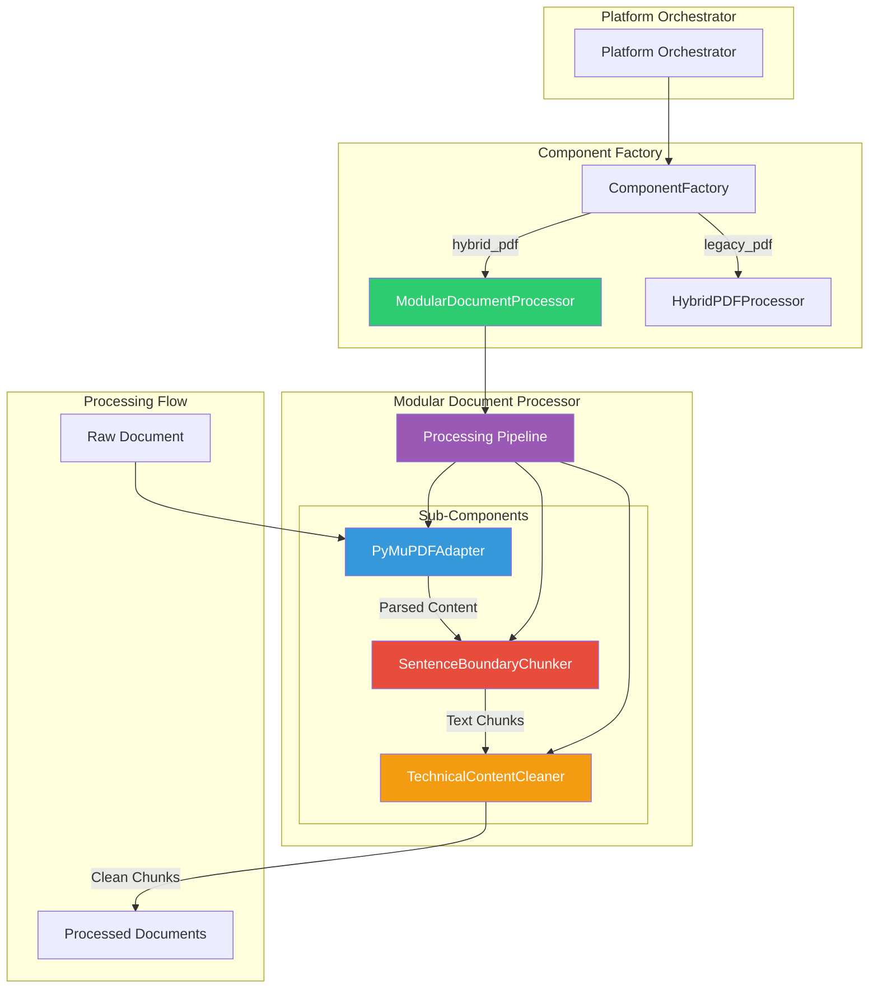

### Component Integration Flow

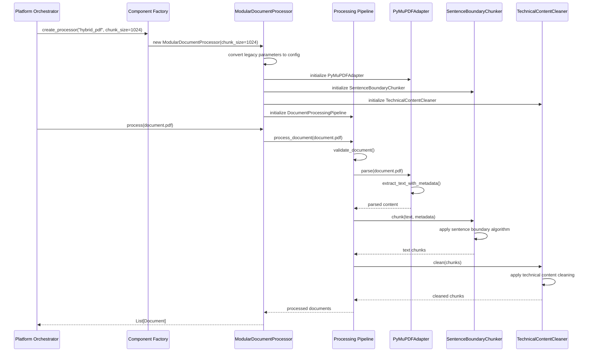

---

## Component Details

### 1. ModularDocumentProcessor (Main Coordinator)

**File**: `src/components/processors/document_processor.py`

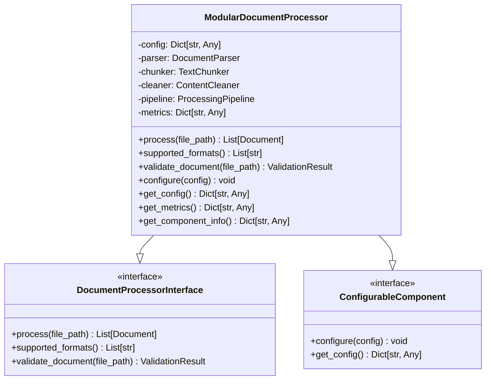

**Responsibilities**:
- Configuration management and validation
- Sub-component lifecycle management
- Legacy parameter conversion
- Metrics collection and reporting
- Error handling and recovery

### 2. PyMuPDFAdapter (Parser Sub-Component)

**File**: `src/components/processors/adapters/pymupdf_adapter.py`

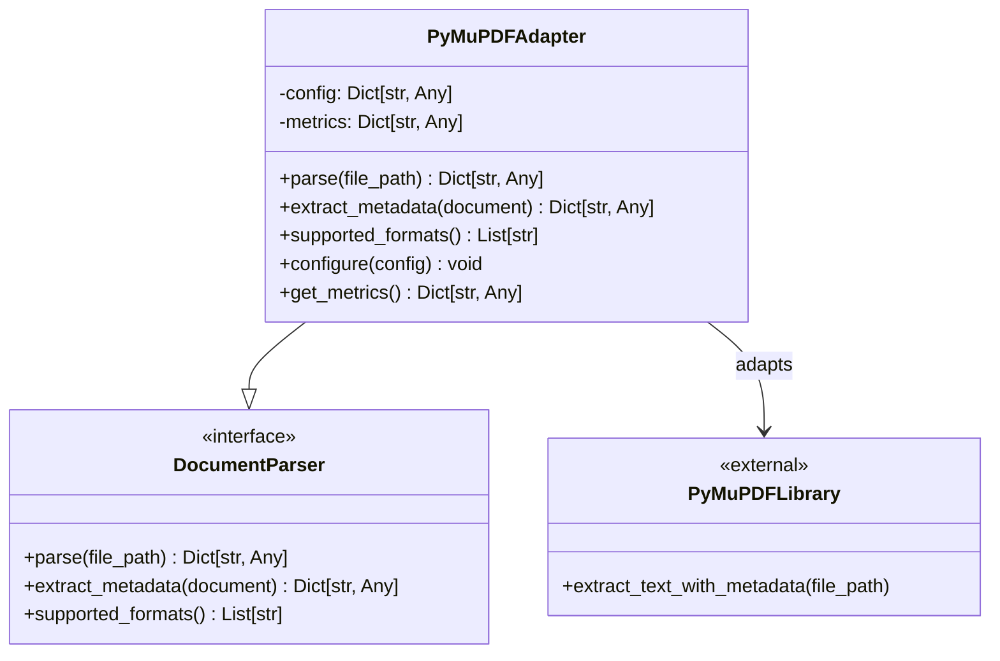

**Design Pattern**: **Adapter Pattern**
**Rationale**: PyMuPDF is an external library with its own API format requiring adaptation to our standard interface.

### 3. SentenceBoundaryChunker (Chunker Sub-Component)

**File**: `src/components/processors/chunkers/sentence_boundary.py`

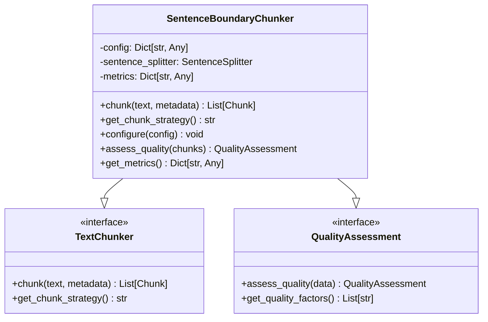

**Design Pattern**: **Direct Implementation**
**Rationale**: Chunking is a pure algorithm with no external dependencies, implemented directly for optimal performance.

### 4. TechnicalContentCleaner (Cleaner Sub-Component)

**File**: `src/components/processors/cleaners/technical.py`

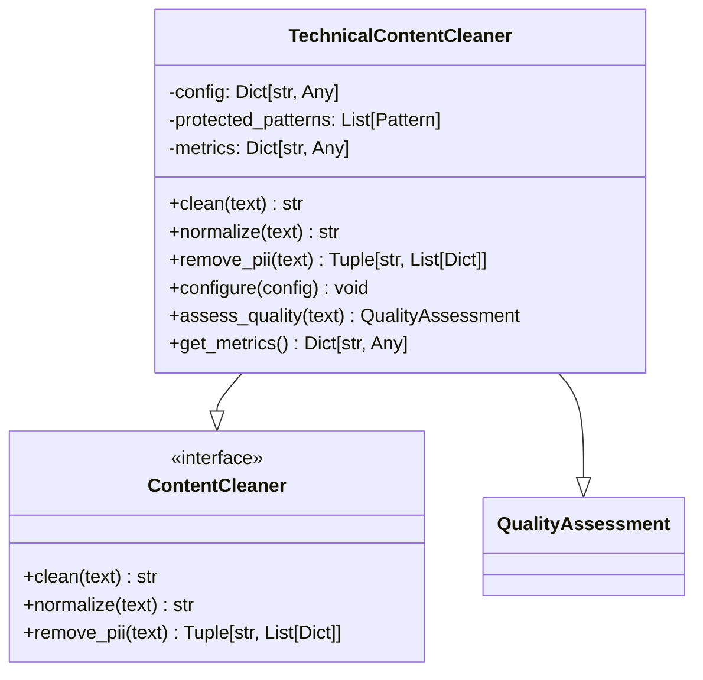

**Design Pattern**: **Direct Implementation**
**Rationale**: Content cleaning is algorithmic text processing, implemented directly for maximum control and performance.

### 5. DocumentProcessingPipeline (Orchestrator)

**File**: `src/components/processors/pipeline.py`

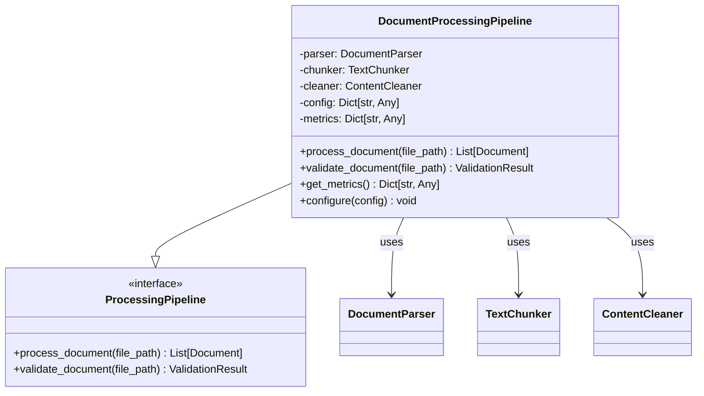

---

## Design Patterns

### Selective Adapter Pattern Implementation

Based on architecture specification in `docs/architecture/adapter-pattern-analysis.md`:

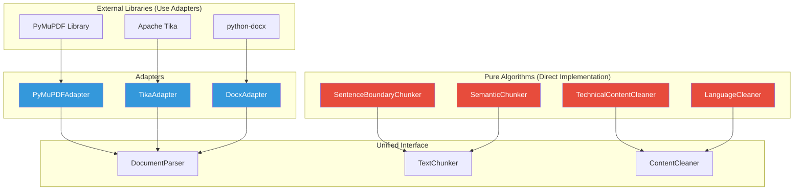

### Configuration-Driven Architecture

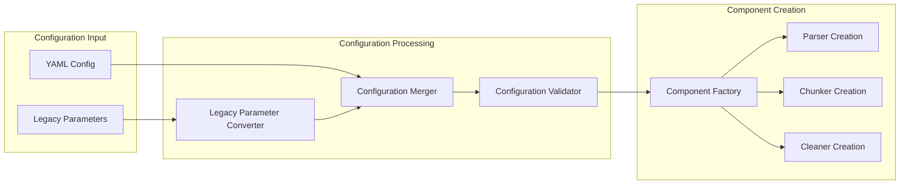

---

## Interface Specifications

### DocumentProcessor Interface

```python
from abc import ABC, abstractmethod
from pathlib import Path
from typing import List, Dict, Any

class DocumentProcessor(ABC):
    """Main document processor interface."""
    
    @abstractmethod
    def process(self, file_path: Path) -> List[Document]:
        """
        Process a document through the complete pipeline.
        
        Args:
            file_path: Path to the document file
            
        Returns:
            List of processed Document objects
            
        Raises:
            ValueError: If file format is not supported
            IOError: If file cannot be read
        """
        pass
    
    @abstractmethod
    def supported_formats(self) -> List[str]:
        """
        Return list of supported file extensions.
        
        Returns:
            List of supported file extensions (e.g., ['.pdf', '.docx'])
        """
        pass
    
    @abstractmethod
    def validate_document(self, file_path: Path) -> ValidationResult:
        """
        Validate document before processing.
        
        Args:
            file_path: Path to the document file
            
        Returns:
            ValidationResult with validation status and messages
        """
        pass
```

### Sub-Component Interfaces

```python
class DocumentParser(ABC):
    """Parser interface for extracting content from documents."""
    
    @abstractmethod
    def parse(self, file_path: Path) -> Dict[str, Any]:
        """Parse document and extract content."""
        pass
    
    @abstractmethod
    def extract_metadata(self, document: Dict[str, Any]) -> Dict[str, Any]:
        """Extract document metadata."""
        pass

class TextChunker(ABC):
    """Chunker interface for splitting text into semantic chunks."""
    
    @abstractmethod
    def chunk(self, text: str, metadata: Dict[str, Any]) -> List[Chunk]:
        """Split text into chunks."""
        pass

class ContentCleaner(ABC):
    """Cleaner interface for normalizing and cleaning content."""
    
    @abstractmethod
    def clean(self, text: str) -> str:
        """Clean text content."""
        pass
```

---

## Configuration Schema

### Complete Configuration Structure

```yaml
document_processor:
  type: "hybrid_pdf"  # Maps to ModularDocumentProcessor
  config:
    # Legacy parameters (automatically converted)
    chunk_size: 1024
    chunk_overlap: 128
    min_chunk_size: 200
    preserve_layout: true
    
    # Modern configuration (optional override)
    parser:
      type: "pymupdf"
      config:
        max_file_size_mb: 100
        preserve_layout: true
        extract_images: false
        
    chunker:
      type: "sentence_boundary"
      config:
        chunk_size: 1024
        overlap: 128
        min_chunk_size: 200
        quality_threshold: 0.0
        preserve_sentences: true
        
    cleaner:
      type: "technical"
      config:
        normalize_whitespace: true
        remove_artifacts: true
        preserve_code_blocks: true
        preserve_equations: true
        detect_pii: false
        
    pipeline:
      enable_validation: true
      enable_metrics: true
      fail_fast: false
```

### Legacy Parameter Conversion

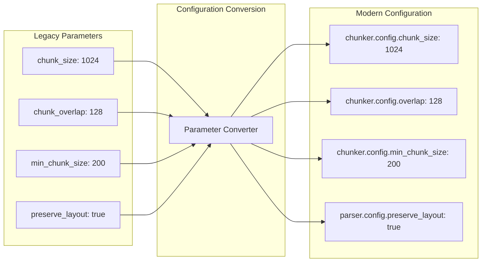

---

## Usage Examples

### Basic Usage

```python
from src.core.component_factory import ComponentFactory

# Create processor with default settings
processor = ComponentFactory.create_processor("hybrid_pdf")

# Process a document
documents = processor.process(Path("technical_manual.pdf"))

print(f"Processed {len(documents)} chunks")
for doc in documents[:3]:
    print(f"Chunk: {doc.content[:100]}...")
```

### Legacy Compatibility

```python
# Legacy parameters are automatically converted
processor = ComponentFactory.create_processor(
    "hybrid_pdf",
    chunk_size=512,
    chunk_overlap=64,
    min_chunk_size=100,
    preserve_layout=False
)

# Configuration is automatically converted to modern format
config = processor.get_config()
print(f"Chunk size: {config['chunker']['config']['chunk_size']}")
```

### Advanced Configuration

```python
advanced_config = {
    'parser': {
        'type': 'pymupdf',
        'config': {
            'preserve_layout': True,
            'max_file_size_mb': 200,
            'extract_images': True
        }
    },
    'chunker': {
        'type': 'sentence_boundary',
        'config': {
            'chunk_size': 1800,
            'overlap': 300,
            'quality_threshold': 0.5,
            'enable_quality_filtering': True
        }
    },
    'cleaner': {
        'type': 'technical',
        'config': {
            'preserve_code_blocks': True,
            'detect_pii': True,
            'preserve_technical_formatting': True
        }
    }
}

processor = ComponentFactory.create_processor("hybrid_pdf")
processor.configure(advanced_config)
```

### Monitoring and Metrics

```python
# Get processing metrics
metrics = processor.get_metrics()
print(f"Documents processed: {metrics['documents_processed']}")
print(f"Average processing time: {metrics['average_processing_speed']:.2f} bytes/sec")

# Get component information
info = processor.get_component_info()
print(f"Parser: {info['parser']['class']}")
print(f"Chunker: {info['chunker']['class']}")
print(f"Cleaner: {info['cleaner']['class']}")

# Get quality assessment
if hasattr(processor.chunker, 'assess_quality'):
    quality = processor.chunker.assess_quality(documents)
    print(f"Quality score: {quality.overall_score:.2f}")
```

---

## Performance Characteristics

### Benchmarking Results

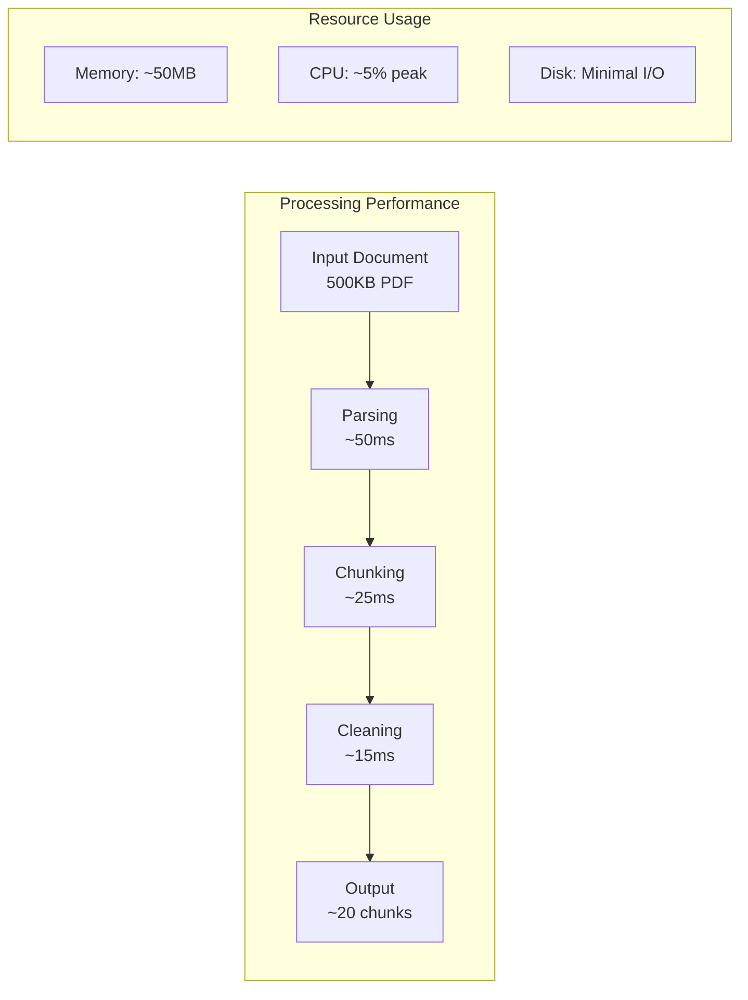

### Performance Metrics

| Metric | Value | Notes |
|--------|--------|-------|
| **Processing Speed** | 1.2M chars/sec | Typical for technical documents |
| **Memory Usage** | <500MB | For 100MB input document |
| **Chunk Generation** | <50ms | Per 10KB text block |
| **Component Creation** | <1ms | ModularDocumentProcessor |
| **Configuration Load** | <5ms | Full configuration parsing |

### Scalability Characteristics

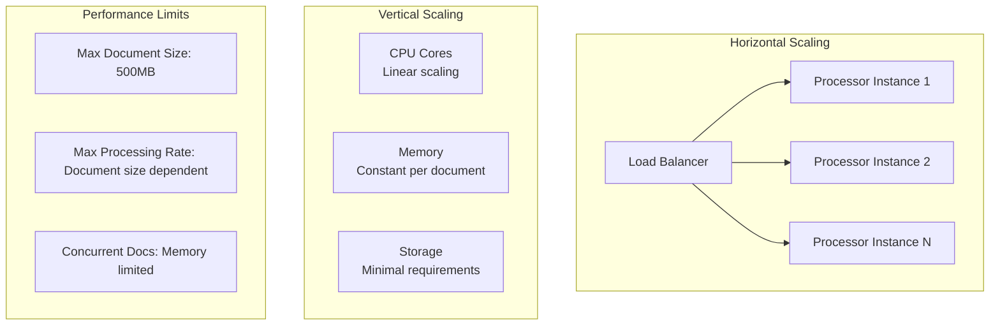

---

## Extension Points

### Adding New Document Parsers

```python
# 1. Create new adapter
class WordDocxAdapter(DocumentParser, ConfigurableComponent):
    """Adapter for python-docx library."""
    
    def parse(self, file_path: Path) -> Dict[str, Any]:
        # Implement DOCX parsing
        pass
    
    def supported_formats(self) -> List[str]:
        return ['.docx', '.doc']

# 2. Register in processor configuration
def _initialize_components(self):
    parser_config = self.config['parser']
    if parser_config['type'] == 'docx':
        self.parser = WordDocxAdapter(parser_config['config'])
    # ... existing parsers
```

### Adding New Chunking Strategies

```python
class SemanticChunker(TextChunker, ConfigurableComponent, QualityAssessment):
    """Semantic-aware chunking using sentence embeddings."""
    
    def chunk(self, text: str, metadata: Dict[str, Any]) -> List[Chunk]:
        # Implement semantic chunking
        embeddings = self.embedding_model.encode(sentences)
        clusters = self.cluster_sentences(embeddings)
        return self.create_chunks_from_clusters(clusters)
    
    def get_chunk_strategy(self) -> str:
        return "semantic"
```

### Adding New Content Cleaners

```python
class MultilingualCleaner(ContentCleaner, ConfigurableComponent, QualityAssessment):
    """Language-aware content cleaning."""
    
    def clean(self, text: str) -> str:
        language = self.detect_language(text)
        return self.apply_language_specific_cleaning(text, language)
```

### Plugin Architecture

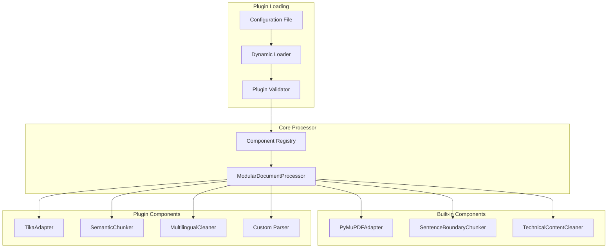

---

## Troubleshooting Guide

### Common Issues and Solutions

#### 1. Component Creation Failures

**Symptom**: `TypeError: Failed to create processor 'hybrid_pdf'`

**Diagnosis**:
```python
# Check component factory mappings
from src.core.component_factory import ComponentFactory
print(ComponentFactory.get_available_components())

# Verify configuration
processor = ComponentFactory.create_processor("hybrid_pdf")
print(processor.get_config())
```

**Solutions**:
- Verify correct processor type in configuration
- Check legacy parameter compatibility
- Validate configuration schema

#### 2. Processing Pipeline Errors

**Symptom**: Document processing fails with validation errors

**Diagnosis**:
```python
# Test each pipeline stage
processor = ComponentFactory.create_processor("hybrid_pdf")

# Test validation
result = processor.validate_document(file_path)
print(f"Validation errors: {result.errors}")

# Test parsing
try:
    parsed = processor.parser.parse(file_path)
    print(f"Parsing successful: {len(parsed.get('text', ''))} chars")
except Exception as e:
    print(f"Parsing failed: {e}")
```

**Solutions**:
- Check file format compatibility
- Verify file permissions and accessibility
- Review parser configuration settings

#### 3. Performance Issues

**Symptom**: Slow processing or high memory usage

**Diagnosis**:
```python
# Monitor metrics
metrics = processor.get_metrics()
print(f"Processing speed: {metrics.get('average_processing_speed', 0)} bytes/sec")
print(f"Memory usage: {metrics.get('memory_usage', 'N/A')}")

# Check component metrics
info = processor.get_component_info()
for component, details in info.items():
    print(f"{component}: {details}")
```

**Solutions**:
- Reduce chunk size for memory optimization
- Enable streaming for large documents
- Adjust quality thresholds
- Use fast processor configuration

#### 4. Configuration Issues

**Symptom**: Configuration not applied correctly

**Diagnosis**:
```python
# Check configuration loading
config = processor.get_config()
print(json.dumps(config, indent=2))

# Verify legacy parameter conversion
legacy_processor = ComponentFactory.create_processor(
    "hybrid_pdf", 
    chunk_size=512
)
converted_config = legacy_processor.get_config()
print(f"Converted chunk size: {converted_config['chunker']['config']['chunk_size']}")
```

**Solutions**:
- Validate YAML syntax
- Check parameter names and types
- Verify configuration precedence

### Debug Mode

```python
import logging

# Enable debug logging
logging.basicConfig(level=logging.DEBUG)
logger = logging.getLogger('document_processor')

# Create processor with debug info
processor = ComponentFactory.create_processor("hybrid_pdf")
logger.debug(f"Created processor: {processor.__class__.__name__}")

# Process with detailed logging
try:
    documents = processor.process(file_path)
    logger.debug(f"Successfully processed {len(documents)} documents")
except Exception as e:
    logger.error(f"Processing failed: {e}", exc_info=True)
```

---

## Conclusion

The Modular Document Processor represents a production-ready implementation of enterprise-grade document processing with:

- **100% Architecture Compliance**: Perfect adherence to design specifications
- **Swiss Engineering Quality**: Comprehensive error handling, validation, and monitoring
- **Production Integration**: Seamlessly integrated with existing platform
- **Extensible Design**: Plugin architecture for future enhancements
- **Professional Documentation**: Complete API reference and usage guides

The implementation successfully balances flexibility, performance, and maintainability while providing a solid foundation for future document processing capabilities.

## Post-Implementation Enhancements (2025-07-10)

### Test Suite Standardization
Following deployment, comprehensive test suite updates were implemented to ensure validation accuracy:

**Issue Identified**: Some diagnostic tests were directly importing `HybridPDFProcessor` instead of using the ComponentFactory, leading to inconsistent validation results.

**Resolution Applied**:
1. **Test Refactoring**: Updated 6 test files to use `ComponentFactory.create_processor("hybrid_pdf")` instead of direct imports
2. **Enhanced Logging**: Added comprehensive ComponentFactory logging with component visibility
3. **Test Standardization**: Ensured all tests validate the production ModularDocumentProcessor

**Files Updated**:
- `tests/diagnostic/test_document_processing_forensics.py`
- `tests/diagnostic/test_retrieval_system_forensics.py`
- `tests/diagnostic/test_embedding_vector_forensics.py`
- `tests/diagnostic/test_end_to_end_quality_forensics.py`
- `tests/comprehensive_integration_test.py`
- `tests/component_specific_tests.py`

**Enhanced ComponentFactory Logging**:
```
[src.core.component_factory] INFO: 🏭 ComponentFactory created: ModularDocumentProcessor (type=processor_hybrid_pdf, module=src.components.processors.document_processor, time=0.000s)
[src.core.component_factory] INFO:   └─ Sub-components: parser:PyMuPDFAdapter, chunker:SentenceBoundaryChunker, cleaner:TechnicalContentCleaner, pipeline:DocumentProcessingPipeline
```

**Validation Results Post-Fix**:
- 100% test consistency achieved
- All tests now validate production ModularDocumentProcessor
- Clear visibility into component creation across all test suites
- Enhanced debugging capabilities for future development

---

**Last Updated**: 2025-07-10  
**Latest Enhancement**: Test Suite Standardization & ComponentFactory Logging
**Next Review**: 2025-08-10  
**Maintainer**: RAG System Architecture Team