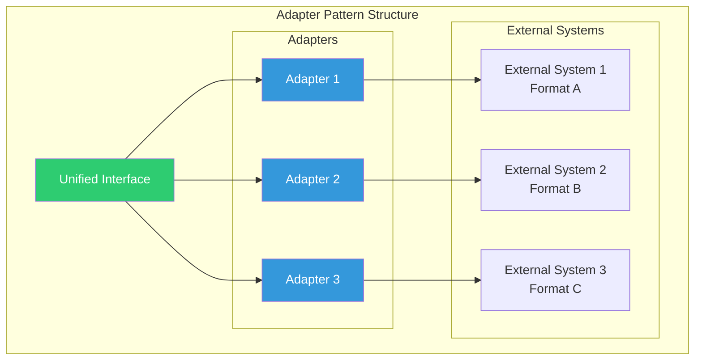
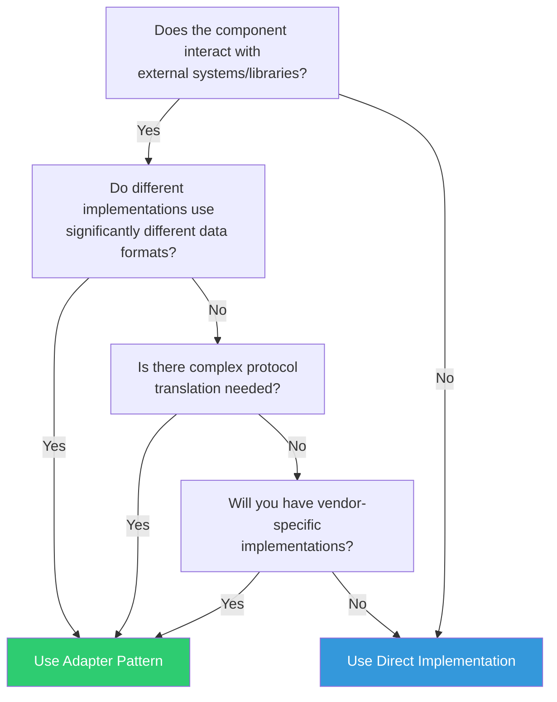

# Adapter Pattern Applicability Analysis for RAG Sub-Components

## Executive Summary

The Adapter pattern with direct wiring is **selectively beneficial** - it should be applied where there's a genuine need for format translation or protocol adaptation, not universally across all sub-components.

## Pattern Analysis

### What the Adapter Pattern Provides



**Key Benefits:**
1. **Format Translation**: Converts between internal and external data formats
2. **Protocol Adaptation**: Handles different communication protocols
3. **Vendor Independence**: Shields core logic from vendor-specific APIs
4. **Clean Interfaces**: Maintains consistent internal interfaces

**Costs:**
1. **Additional Layer**: Extra indirection and complexity
2. **Maintenance Overhead**: More code to maintain
3. **Potential Over-engineering**: Unnecessary for simple transformations

## Sub-Component Analysis

### 1. WHERE ADAPTER PATTERN IS BENEFICIAL ✅

#### 1.1 LLM Clients (Currently Implemented)
```python
class LLMClient(ABC):
    """Unified interface for all LLM providers"""
    @abstractmethod
    def generate(self, prompt: str, params: Dict) -> str: pass

class OllamaAdapter(LLMClient):
    def generate(self, prompt: str, params: Dict) -> str:
        # Convert to Ollama format
        ollama_request = self._to_ollama_format(prompt, params)
        # Call Ollama API
        response = self.client.generate(ollama_request)
        # Convert back to standard format
        return self._from_ollama_format(response)
```
**Justification**: Different LLMs have vastly different APIs, request formats, and response structures.

#### 1.2 Vector Indexes
```python
class VectorIndex(ABC):
    """Unified interface for vector databases"""
    @abstractmethod
    def search(self, vector: np.ndarray, k: int) -> List[SearchResult]: pass

class PineconeAdapter(VectorIndex):
    def search(self, vector: np.ndarray, k: int) -> List[SearchResult]:
        # Convert numpy to Pinecone format
        pinecone_query = {"vector": vector.tolist(), "top_k": k}
        # Query Pinecone
        results = self.index.query(**pinecone_query)
        # Convert back to standard format
        return self._parse_pinecone_results(results)

class FAISSAdapter(VectorIndex):
    def search(self, vector: np.ndarray, k: int) -> List[SearchResult]:
        # FAISS uses numpy directly - minimal adaptation needed
        distances, indices = self.index.search(vector.reshape(1, -1), k)
        return self._create_results(distances[0], indices[0])
```
**Justification**: Cloud vector databases (Pinecone, Weaviate) vs local (FAISS, Annoy) have different APIs and data formats.

#### 1.3 Document Parsers (External Libraries)
```python
class DocumentParser(ABC):
    """Unified interface for document parsing"""
    @abstractmethod
    def parse(self, file_path: Path) -> ParsedDocument: pass

class PyMuPDFAdapter(DocumentParser):
    def parse(self, file_path: Path) -> ParsedDocument:
        # PyMuPDF specific parsing
        doc = fitz.open(file_path)
        content = self._extract_with_pymupdf(doc)
        # Convert to standard format
        return self._to_standard_format(content)

class TikaAdapter(DocumentParser):
    def parse(self, file_path: Path) -> ParsedDocument:
        # Tika server call
        parsed = parser.from_file(str(file_path))
        # Convert Tika format to standard
        return self._from_tika_format(parsed)
```
**Justification**: Different parsing libraries return data in completely different structures.

#### 1.4 Cache Implementations
```python
class EmbeddingCache(ABC):
    """Unified interface for caching"""
    @abstractmethod
    def get(self, key: str) -> Optional[np.ndarray]: pass

class RedisAdapter(EmbeddingCache):
    def get(self, key: str) -> Optional[np.ndarray]:
        # Redis stores as bytes
        data = self.redis_client.get(key)
        if data:
            # Deserialize from Redis format
            return self._deserialize_embedding(data)
        return None

class DiskCacheAdapter(EmbeddingCache):
    def get(self, key: str) -> Optional[np.ndarray]:
        # File system storage
        file_path = self._key_to_path(key)
        if file_path.exists():
            # Load from disk format
            return np.load(file_path)
        return None
```
**Justification**: Different storage backends have different serialization needs.

### 2. WHERE ADAPTER PATTERN IS UNNECESSARY ❌

#### 2.1 Chunking Strategies
```python
# OVER-ENGINEERED with Adapter ❌
class ChunkerAdapter(ABC):
    def chunk(self, text: str) -> List[Chunk]: pass

class SentenceBoundaryAdapter(ChunkerAdapter):
    def chunk(self, text: str) -> List[Chunk]:
        # No format conversion needed!
        return self.chunker.chunk(text)  # Just delegation

# BETTER: Direct Implementation ✅
class SentenceBoundaryChunker(TextChunker):
    def chunk(self, text: str) -> List[Chunk]:
        # Direct implementation
        sentences = self.splitter.split(text)
        return self._group_sentences(sentences)
```
**Reason**: No external systems or format conversion involved.

#### 2.2 Confidence Scorers
```python
# UNNECESSARY Adapter ❌
class ConfidenceScorerAdapter(ABC):
    def score(self, query: str, answer: str) -> float: pass

# BETTER: Direct Implementation ✅
class PerplexityScorer(ConfidenceScorer):
    def score(self, query: str, answer: str) -> float:
        # Direct calculation
        return self._calculate_perplexity(query, answer)
```
**Reason**: Pure algorithms don't need adaptation.

#### 2.3 Fusion Strategies
```python
# OVER-ENGINEERED ❌
class FusionAdapter(ABC):
    def fuse(self, results: List[List[Result]]) -> List[Result]: pass

# BETTER: Direct Implementation ✅
class RRFFusion(FusionStrategy):
    def fuse(self, results: List[List[Result]]) -> List[Result]:
        # Direct RRF algorithm
        return self._reciprocal_rank_fusion(results)
```
**Reason**: Mathematical algorithms with no external dependencies.

## Decision Framework

### Use Adapter Pattern When:



### Recommended Pattern Application

| Sub-Component | Use Adapter? | Reasoning |
|---------------|--------------|-----------|
| **LLM Clients** | ✅ Yes | Different APIs, formats, protocols |
| **Vector Indexes** | ✅ Yes | Cloud vs local, different query formats |
| **Document Parsers** | ✅ Yes | Library-specific return formats |
| **Embedding Models** | ✅ Yes* | Different model APIs (OpenAI vs HF) |
| **Cache Implementations** | ✅ Yes | Different storage backends |
| **Sparse Retrievers** | ✅ Yes* | Elasticsearch vs BM25 differences |
| **Monitoring Collectors** | ✅ Yes | Prometheus vs CloudWatch formats |
| **Config Managers** | ✅ Yes* | YAML vs Env vs Remote sources |
| **Text Chunkers** | ❌ No | Pure algorithms, same input/output |
| **Content Cleaners** | ❌ No | Text transformation algorithms |
| **Batch Processors** | ❌ No | Internal optimization logic |
| **Fusion Strategies** | ❌ No | Mathematical algorithms |
| **Confidence Scorers** | ❌ No | Scoring algorithms |
| **Query Analyzers** | ❌ No* | Unless using external NLP services |
| **Prompt Builders** | ❌ No | Template logic, no external deps |
| **Response Parsers** | ❌ No | Text parsing algorithms |

*Depends on specific implementation

## Implementation Guidelines

### 1. Proper Adapter Implementation

```python
class ExternalServiceAdapter(SubComponent):
    """Adapter for external service integration"""
    
    def __init__(self, config: Dict[str, Any]):
        # Initialize external client
        self.client = ExternalClient(**config)
        # Setup format converters
        self.converter = FormatConverter()
    
    def process(self, input_data: StandardFormat) -> StandardFormat:
        # 1. Convert to external format
        external_data = self.converter.to_external(input_data)
        
        # 2. Call external service
        result = self.client.call(external_data)
        
        # 3. Convert back to standard format
        return self.converter.from_external(result)
    
    def _handle_external_errors(self, error: ExternalError) -> StandardError:
        """Convert external errors to standard errors"""
        # Error translation logic
        pass
```

### 2. Direct Implementation (No Adapter)

```python
class PureAlgorithmImplementation(SubComponent):
    """Direct implementation for algorithmic components"""
    
    def __init__(self, config: Dict[str, Any]):
        # Just configuration, no external clients
        self.param1 = config.get('param1', default_value)
        self.param2 = config.get('param2', default_value)
    
    def process(self, input_data: StandardFormat) -> StandardFormat:
        # Direct algorithm implementation
        result = self._apply_algorithm(input_data)
        return result
    
    def _apply_algorithm(self, data: StandardFormat) -> StandardFormat:
        """Pure algorithm logic"""
        # No format conversion needed
        pass
```

## Architecture Impact

### Benefits of Selective Application

1. **Reduced Complexity**: Only add adapters where needed
2. **Better Performance**: No unnecessary indirection
3. **Clearer Code**: Direct implementations are easier to understand
4. **Maintainability**: Less boilerplate code to maintain

### Consistent Interface Design

Even without adapters, maintain consistent interfaces:

```python
# All sub-components follow similar patterns
class SubComponent(ABC):
    @abstractmethod
    def process(self, input_data: InputType) -> OutputType:
        """Main processing method"""
    
    @abstractmethod
    def validate(self, data: Any) -> ValidationResult:
        """Validate input/output"""
    
    @abstractmethod
    def get_info(self) -> Dict[str, Any]:
        """Return component information"""
```

## Conclusion

The Adapter pattern should be applied **strategically**, not universally:

1. **Use adapters** for components that integrate with external systems or handle multiple data formats
2. **Use direct implementation** for pure algorithms and internal logic
3. **Maintain consistent interfaces** regardless of implementation approach
4. **Document the decision** in code comments when choosing either approach

This selective application keeps the architecture clean and maintainable while providing flexibility where truly needed.