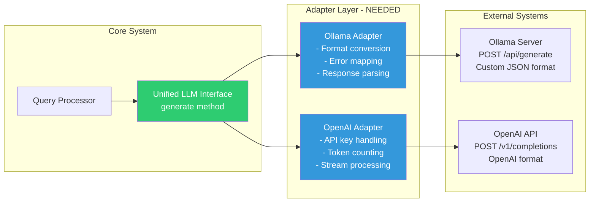
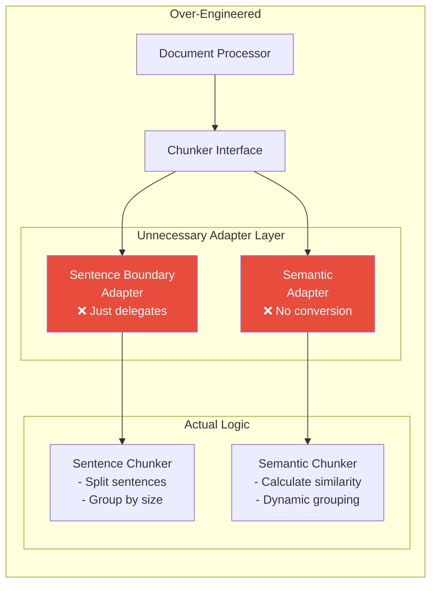
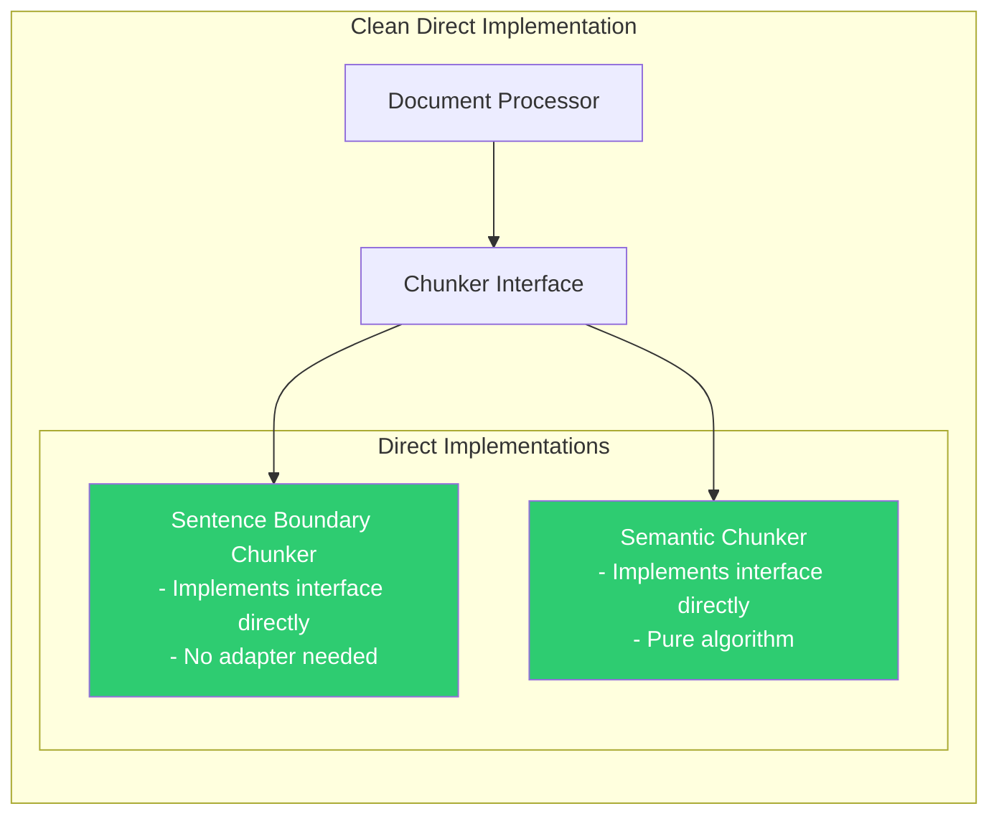

# Adapter Pattern - Practical Examples and Anti-Examples

## Visual Comparison: When to Use vs Avoid Adapters

### ✅ GOOD: LLM Client with Adapter Pattern



**Why it's good**: Different APIs, authentication methods, request/response formats

### ❌ BAD: Text Chunker with Unnecessary Adapter



**Why it's bad**: No external systems, no format conversion, just unnecessary indirection

### ✅ BETTER: Direct Implementation for Chunkers



## Real Code Examples

### 1. Where Adapter Adds Value: Vector Index

```python
# GOOD: Adapter pattern for external vector databases ✅

class VectorIndex(ABC):
    """Unified interface for all vector stores"""
    @abstractmethod
    def search(self, vector: np.ndarray, k: int) -> List[SearchResult]:
        pass

class PineconeAdapter(VectorIndex):
    """Adapter for Pinecone cloud vector database"""
    
    def __init__(self, api_key: str, index_name: str):
        import pinecone
        pinecone.init(api_key=api_key)
        self.index = pinecone.Index(index_name)
    
    def search(self, vector: np.ndarray, k: int) -> List[SearchResult]:
        # CONVERSION NEEDED: numpy array to Pinecone format
        pinecone_query = {
            "vector": vector.tolist(),  # Convert numpy to list
            "top_k": k,
            "include_metadata": True
        }
        
        # PROTOCOL ADAPTATION: REST API call
        response = self.index.query(**pinecone_query)
        
        # FORMAT TRANSLATION: Pinecone response to standard format
        results = []
        for match in response['matches']:
            results.append(SearchResult(
                id=match['id'],
                score=match['score'],  # Pinecone uses different scoring
                metadata=match.get('metadata', {})
            ))
        
        return results

class FAISSAdapter(VectorIndex):
    """Adapter for local FAISS index"""
    
    def __init__(self, dimension: int):
        import faiss
        self.index = faiss.IndexFlatIP(dimension)
        self.id_map = {}  # FAISS uses integers, we need string IDs
    
    def search(self, vector: np.ndarray, k: int) -> List[SearchResult]:
        # MINIMAL ADAPTATION: FAISS works with numpy directly
        distances, indices = self.index.search(vector.reshape(1, -1), k)
        
        # ID MAPPING: FAISS uses integer indices
        results = []
        for i, (dist, idx) in enumerate(zip(distances[0], indices[0])):
            if idx != -1:  # Valid result
                results.append(SearchResult(
                    id=self.id_map.get(idx, str(idx)),
                    score=float(dist),  # Convert to Python float
                    metadata={}
                ))
        
        return results
```

### 2. Where Adapter is Overkill: Chunking

```python
# BAD: Unnecessary adapter for pure algorithm ❌

class ChunkerAdapter(TextChunker):
    """UNNECESSARY adapter layer"""
    def __init__(self, implementation: str):
        if implementation == "sentence":
            self.chunker = SentenceBoundaryChunkerImpl()
        elif implementation == "semantic":
            self.chunker = SemanticChunkerImpl()
    
    def chunk(self, text: str, metadata: Dict) -> List[Chunk]:
        # Just delegates - no value added!
        return self.chunker.chunk(text, metadata)

# GOOD: Direct implementation ✅

class SentenceBoundaryChunker(TextChunker):
    """Direct implementation of chunking algorithm"""
    
    def __init__(self, chunk_size: int = 1000, overlap: int = 200):
        self.chunk_size = chunk_size
        self.overlap = overlap
        self.sentence_splitter = self._init_splitter()
    
    def chunk(self, text: str, metadata: Dict) -> List[Chunk]:
        # Direct algorithm implementation
        sentences = self.sentence_splitter.split(text)
        chunks = []
        current_chunk = []
        current_size = 0
        
        for sentence in sentences:
            sentence_size = len(sentence)
            
            if current_size + sentence_size > self.chunk_size and current_chunk:
                # Create chunk
                chunks.append(self._create_chunk(current_chunk, metadata))
                # Handle overlap
                current_chunk = self._get_overlap(current_chunk)
                current_size = sum(len(s) for s in current_chunk)
            
            current_chunk.append(sentence)
            current_size += sentence_size
        
        # Don't forget the last chunk
        if current_chunk:
            chunks.append(self._create_chunk(current_chunk, metadata))
        
        return chunks
```

### 3. Hybrid Approach: Embedding Models

```python
# GOOD: Adapter only for external services ✅

class EmbeddingModel(ABC):
    """Base embedding model interface"""
    @abstractmethod
    def encode(self, texts: List[str]) -> np.ndarray:
        pass

# Direct implementation for local model
class SentenceTransformerModel(EmbeddingModel):
    """Direct implementation - no adapter needed"""
    
    def __init__(self, model_name: str = "all-MiniLM-L6-v2"):
        from sentence_transformers import SentenceTransformer
        self.model = SentenceTransformer(model_name)
    
    def encode(self, texts: List[str]) -> np.ndarray:
        # Direct usage - sentence_transformers returns numpy arrays
        return self.model.encode(texts, convert_to_numpy=True)

# Adapter for external API
class OpenAIEmbeddingAdapter(EmbeddingModel):
    """Adapter needed for external API"""
    
    def __init__(self, api_key: str, model: str = "text-embedding-3-small"):
        import openai
        self.client = openai.Client(api_key=api_key)
        self.model = model
    
    def encode(self, texts: List[str]) -> np.ndarray:
        # PROTOCOL ADAPTATION: REST API call
        response = self.client.embeddings.create(
            input=texts,
            model=self.model
        )
        
        # FORMAT CONVERSION: API response to numpy
        embeddings = []
        for item in response.data:
            embeddings.append(item.embedding)
        
        return np.array(embeddings)
```

## Architecture Guidelines

### Decision Tree for Adapter Pattern

```python
def should_use_adapter(component_info: Dict) -> bool:
    """Determine if adapter pattern is appropriate"""
    
    # Check for external dependencies
    if component_info.get('external_api'):
        return True
    
    # Check for format conversion needs
    if component_info.get('format_conversion'):
        return True
    
    # Check for protocol differences
    if component_info.get('different_protocols'):
        return True
    
    # Check for vendor-specific implementations
    if component_info.get('multiple_vendors'):
        return True
    
    # Otherwise, use direct implementation
    return False

# Examples
components = [
    {
        "name": "LLM Client",
        "external_api": True,
        "format_conversion": True,
        "different_protocols": True,
        "multiple_vendors": True
    },  # Result: Use Adapter ✅
    
    {
        "name": "Text Chunker",
        "external_api": False,
        "format_conversion": False,
        "different_protocols": False,
        "multiple_vendors": False
    },  # Result: Direct Implementation ✅
    
    {
        "name": "Vector Index",
        "external_api": True,  # Cloud providers
        "format_conversion": True,  # Different formats
        "different_protocols": True,  # REST vs local
        "multiple_vendors": True  # Pinecone, Weaviate, etc.
    },  # Result: Use Adapter ✅
]
```

## Component Factory with Mixed Approach

```python
class ComponentFactory:
    """Factory that creates both adapted and direct components"""
    
    @staticmethod
    def create_embedder(config: ComponentConfig) -> EmbeddingModel:
        impl_type = config.implementation
        
        # Direct implementations (no adapter needed)
        if impl_type == "sentence_transformer":
            return SentenceTransformerModel(**config.config)
        elif impl_type == "custom_model":
            return CustomEmbeddingModel(**config.config)
        
        # Adapter implementations (external services)
        elif impl_type == "openai":
            return OpenAIEmbeddingAdapter(**config.config)
        elif impl_type == "cohere":
            return CohereEmbeddingAdapter(**config.config)
        
        raise ValueError(f"Unknown embedder: {impl_type}")
    
    @staticmethod
    def create_chunker(config: ComponentConfig) -> TextChunker:
        impl_type = config.implementation
        
        # All direct implementations (no adapters needed)
        if impl_type == "sentence_boundary":
            return SentenceBoundaryChunker(**config.config)
        elif impl_type == "semantic":
            return SemanticChunker(**config.config)
        elif impl_type == "structural":
            return StructuralChunker(**config.config)
        
        raise ValueError(f"Unknown chunker: {impl_type}")
```

## Summary: Architectural Principles

1. **Use Adapters for External Integration**
   - External APIs (OpenAI, Pinecone)
   - Different protocols (REST, gRPC, local)
   - Format conversion (JSON ↔ protobuf)

2. **Use Direct Implementation for Algorithms**
   - Text processing algorithms
   - Mathematical computations
   - Internal transformations

3. **Maintain Consistent Interfaces**
   - All implementations follow the same interface
   - Whether using adapter or direct implementation
   - Enables easy testing and swapping

4. **Document the Decision**
   ```python
   class ComponentImplementation:
       """
       Direct implementation - no adapter needed.
       
       Rationale: Pure algorithm with no external dependencies.
       All implementations work with the same data formats.
       """
   ```

5. **Keep It Simple**
   - Don't add adapters "just in case"
   - Add them when you need them
   - Refactor when requirements change