# RAG System - Architectural Patterns and Design Decisions

## 1. Overall System Architecture

```mermaid
graph TB
    subgraph "External Layer"
        Client[Client Applications]
        Config[Configuration Sources]
        Monitor[Monitoring Systems]
        LLMProv[LLM Providers]
    end
    
    subgraph "Orchestration Layer"
        PO[Platform Orchestrator]
        CF[Component Factory]
    end
    
    subgraph "Core Components"
        DP[Document Processor]
        EMB[Embedder]
        RET[Retriever]
        QP[Query Processor]
        AG[Answer Generator]
    end
    
    subgraph "Sub-Component Layer"
        direction LR
        SubDP[Parser|Chunker|Cleaner]
        SubEMB[Model|Batch|Cache]
        SubRET[Vector|Sparse|Fusion|Rerank]
        SubQP[Analyzer|Selector|Assembler]
        SubAG[Prompt|LLM|Parser|Scorer]
    end
    
    subgraph "Storage Layer"
        VecDB[(Vector Store)]
        Cache[(Cache)]
        Config[(Config Store)]
    end
    
    Client --> PO
    Config --> PO
    PO --> CF
    CF --> DP & EMB & RET & QP & AG
    
    DP --> SubDP
    EMB --> SubEMB
    RET --> SubRET
    QP --> SubQP
    AG --> SubAG
    
    SubRET --> VecDB
    SubEMB --> Cache
    AG --> LLMProv
    
    PO --> Monitor
    
    style PO fill:#e74c3c,color:#fff
    style CF fill:#9b59b6,color:#fff
```

## 2. Key Architectural Patterns

### 2.1 Adapter Pattern (Answer Generator)

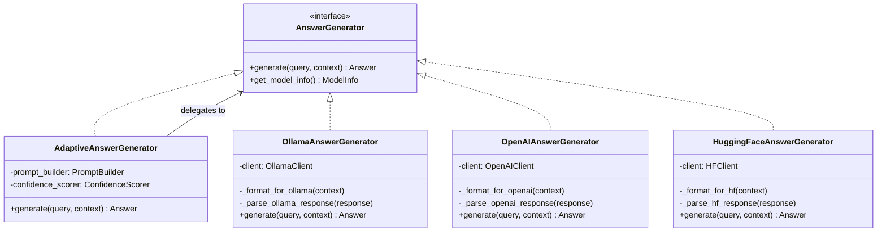

### 2.2 Strategy Pattern (Multiple Implementations)

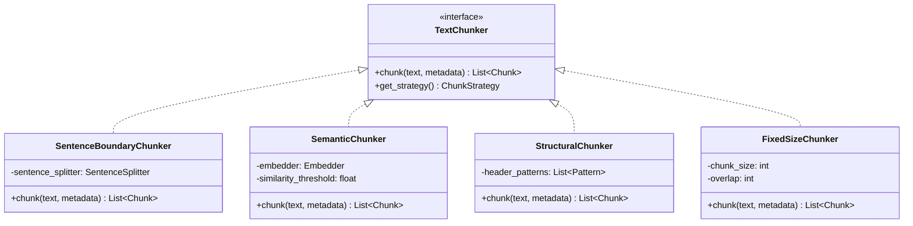

### 2.3 Factory Pattern (Component Creation)

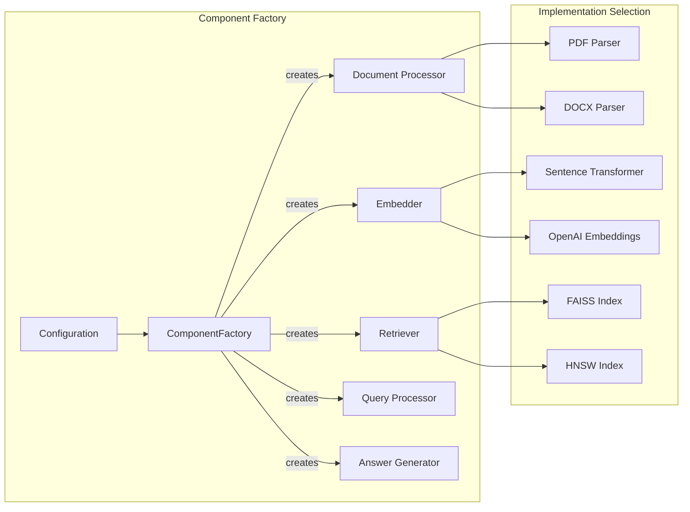

### 2.4 Pipeline Pattern (Document Processing)

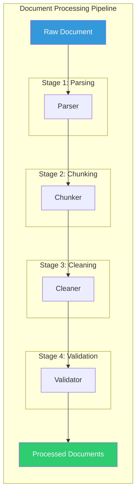

## 3. Design Decisions and Rationale

### 3.1 Sub-Component Architecture Benefits

| Decision | Rationale | Benefits |
|----------|-----------|----------|
| **Consistent Interfaces** | Each sub-component type shares common methods | Easy testing, swappable implementations |
| **Multiple Implementations** | 3-4 options per sub-component | Scale flexibility, optimization choices |
| **Configuration-Driven** | Behavior controlled by YAML config | No code changes for different deployments |
| **Dependency Injection** | Components receive sub-components | Testability, loose coupling |

### 3.2 Performance Optimization Strategies

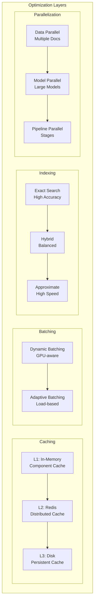

### 3.3 Scalability Patterns

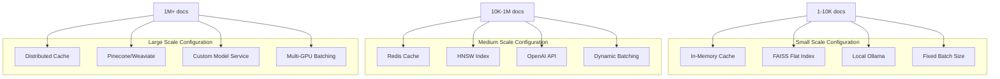

## 4. Error Handling and Resilience

### 4.1 Circuit Breaker Pattern

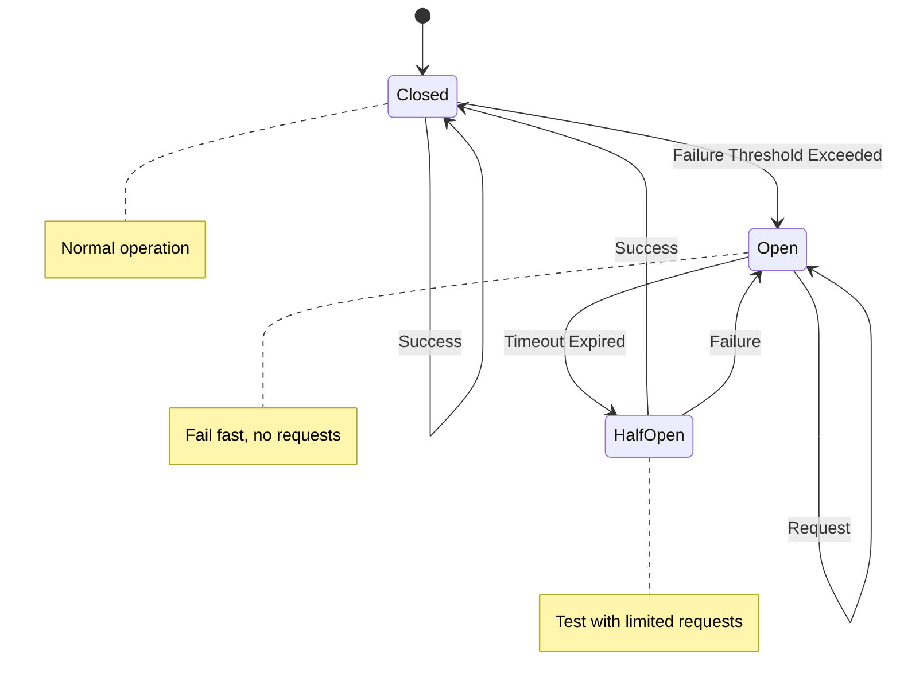

### 4.2 Graceful Degradation Strategy

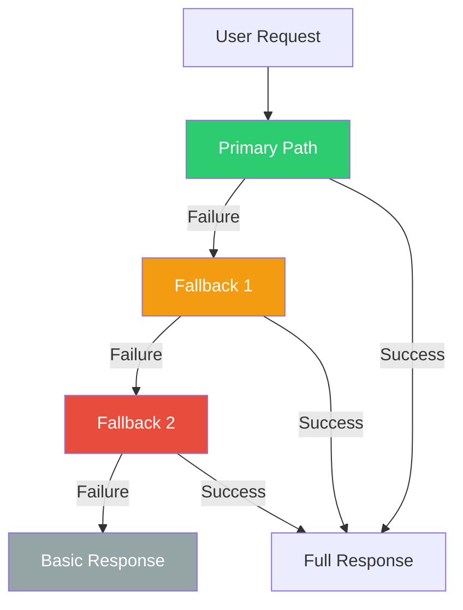

## 5. Swiss Engineering Standards Implementation

### 5.1 Quality Assurance Architecture

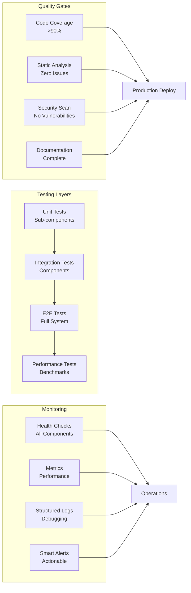

### 5.2 Configuration Validation Schema

```yaml
# Example Configuration with Validation Rules
document_processor:
  parser:
    type: "pdf"  # enum: [pdf, docx, html, markdown]
    implementation: "pymupdf"  # enum: [pymupdf, pdfplumber, tika]
    config:
      extract_images: false  # type: boolean
      preserve_layout: true  # type: boolean
      max_file_size: 100  # type: integer, min: 1, max: 1000 (MB)
      
  chunker:
    type: "semantic"  # enum: [sentence_boundary, semantic, structural, fixed_size]
    implementation: "sentence_aware"
    config:
      chunk_size: 1000  # type: integer, min: 100, max: 5000
      chunk_overlap: 200  # type: integer, min: 0, max: chunk_size/2
      min_chunk_size: 100  # type: integer, min: 50
      
  cleaner:
    type: "technical"  # enum: [technical, language, pii]
    config:
      remove_code_artifacts: true  # type: boolean
      normalize_terms: true  # type: boolean
      detect_pii: true  # type: boolean
      pii_action: "redact"  # enum: [redact, remove, flag]
```

## 6. Future Extension Points

### 6.1 Plugin Architecture

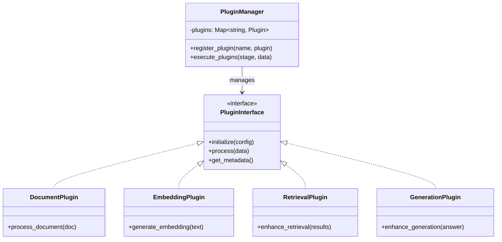

### 6.2 Multi-Tenant Architecture

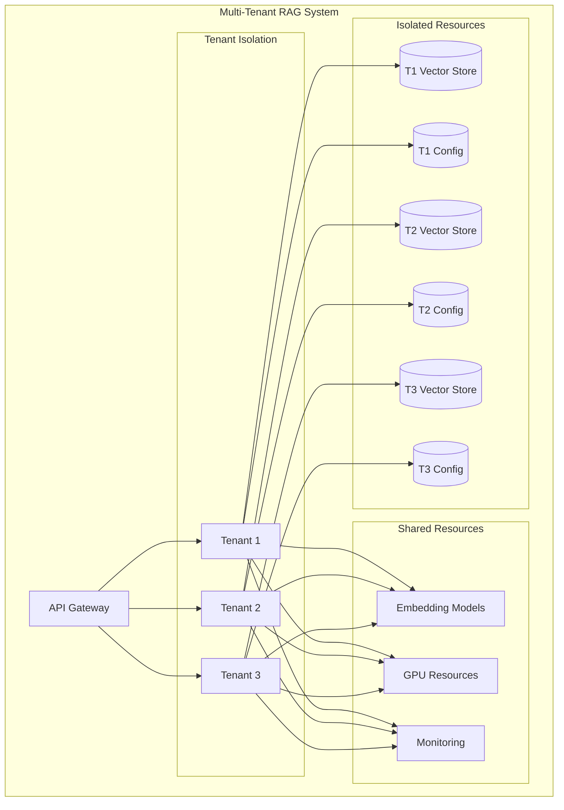

## Conclusion

This architecture provides:

1. **Flexibility**: Multiple implementations for different scales and requirements
2. **Maintainability**: Clean interfaces and separation of concerns
3. **Testability**: Dependency injection and mockable components
4. **Performance**: Multi-level optimization strategies
5. **Reliability**: Error handling and graceful degradation
6. **Scalability**: From local development to enterprise deployment
7. **Extensibility**: Plugin architecture and clear extension points

The sub-component architecture elevates the system from a solid implementation to a truly enterprise-grade solution suitable for production deployment in demanding environments.