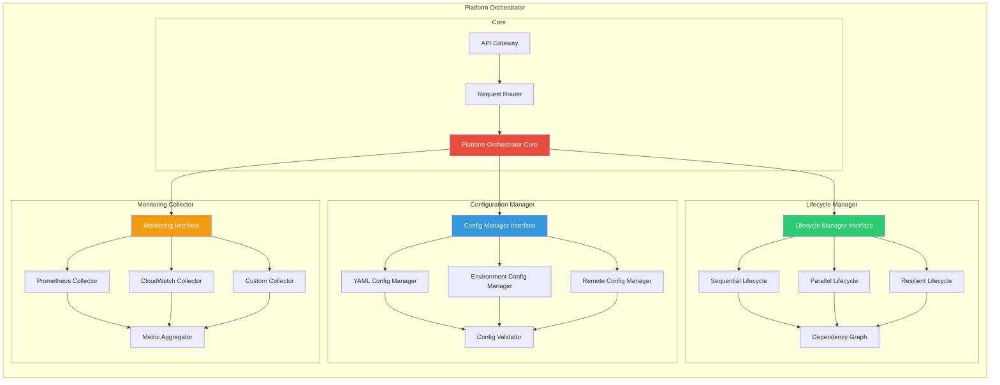
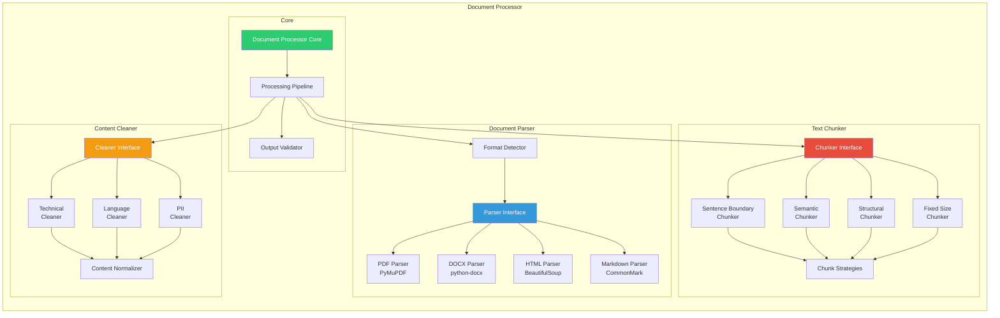
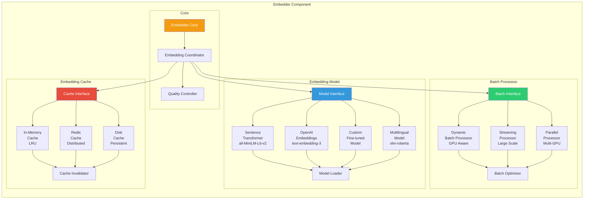
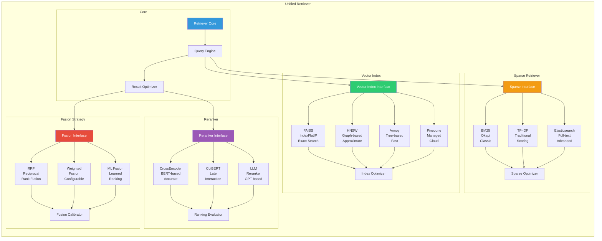
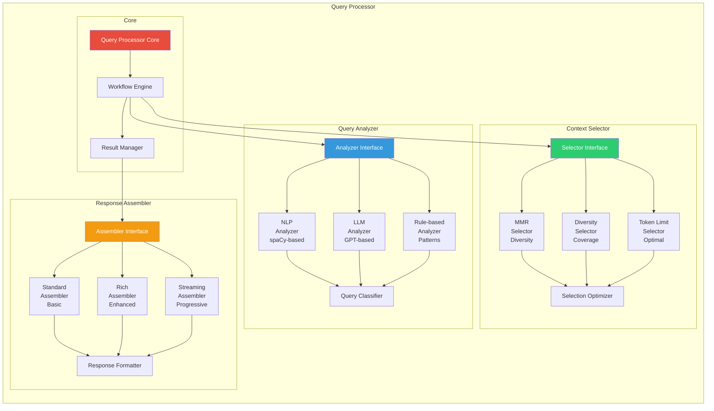
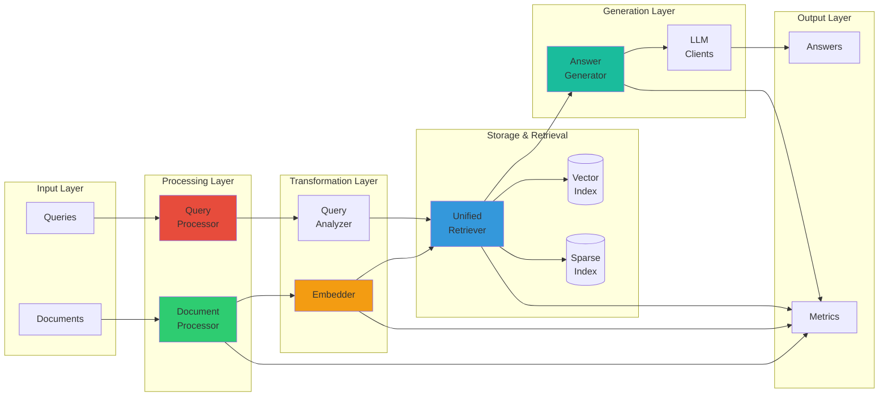

# RAG System - Component Architecture Block Diagrams

## 1. Platform Orchestrator Architecture

## 2. Document Processor Architecture

## 3. Embedder Architecture

## 4. Unified Retriever Architecture

## 5. Answer Generator Architecture (Adapter Pattern)

```mermaid
graph TB
    subgraph "Answer Generator"
        direction TB
        
        subgraph "Core Adapter"
            AG[Adaptive Answer Generator<br/>Orchestrator]
            UI[Unified Interface]
            QM[Quality Monitor]
        end
        
        subgraph "Prompt Builder"
            PB[Prompt Builder Interface]
            Simple[Simple<br/>Prompt<br/>Basic Q&A]
            CoT[Chain of<br/>Thought<br/>Reasoning]
            FewShot[Few-Shot<br/>Examples<br/>Learning]
            Adaptive[Adaptive<br/>Dynamic<br/>Selection]
            PT[Prompt Templates]
        end
        
        subgraph "LLM Client Adapters"
            LLM[LLM Client Interface]
            
            subgraph "Ollama Adapter"
                OA[Ollama<br/>Generator]
                OF[Ollama<br/>Formatter]
            end
            
            subgraph "OpenAI Adapter"
                OAI[OpenAI<br/>Generator]
                OAIF[OpenAI<br/>Formatter]
            end
            
            subgraph "HuggingFace Adapter"
                HF[HuggingFace<br/>Generator]
                HFF[HF<br/>Formatter]
            end
            
            subgraph "Custom Adapter"
                CA[Custom<br/>Generator]
                CF[Custom<br/>Formatter]
            end
        end
        
        subgraph "Response Parser"
            RP[Parser Interface]
            MDP[Markdown<br/>Parser<br/>Formatted]
            JP[JSON<br/>Parser<br/>Structured]
            CP[Citation<br/>Parser<br/>References]
            PV[Parse Validator]
        end
        
        subgraph "Confidence Scorer"
            CS[Scorer Interface]
            PS[Perplexity<br/>Scorer<br/>Model-based]
            SS[Semantic<br/>Scorer<br/>Similarity]
            CovS[Coverage<br/>Scorer<br/>Completeness]
            ES[Ensemble<br/>Scorer<br/>Combined]
            SC[Score Calibrator]
        end
        
        AG --> UI
        UI --> QM
        
        AG --> PB
        PB --> Simple & CoT & FewShot & Adaptive
        Simple & CoT & FewShot & Adaptive --> PT
        
        AG --> LLM
        LLM --> OA & OAI & HF & CA
        OA --> OF
        OAI --> OAIF
        HF --> HFF
        CA --> CF
        
        AG --> RP
        RP --> MDP & JP & CP
        MDP & JP & CP --> PV
        
        AG --> CS
        CS --> PS & SS & CovS & ES
        PS & SS & CovS & ES --> SC
    end
    
    style AG fill:#1abc9c,color:#fff
    style PB fill:#3498db,color:#fff
    style LLM fill:#e74c3c,color:#fff
    style RP fill:#f39c12,color:#fff
    style CS fill:#9b59b6,color:#fff
```

## 6. Query Processor Architecture

## 7. Data Flow Between Components

