# RAG System - Sub-Component Interaction Diagrams

## 1. Document Processing Sub-Component Interactions

### 1.1 PDF Processing Flow

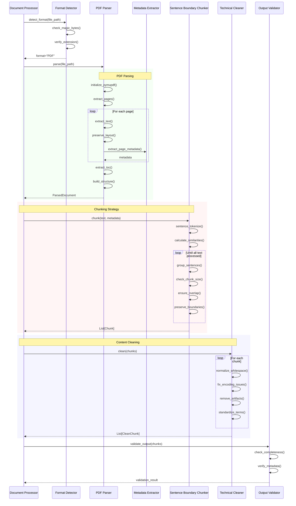

### 1.2 Semantic Chunking Strategy

```mermaid
flowchart TB
    subgraph "Semantic Chunking Process"
        Input[Raw Text]
        
        subgraph "Sentence Processing"
            ST[Sentence Tokenizer]
            SE[Sentence Embedder]
            SV[(Sentence Vectors)]
        end
        
        subgraph "Similarity Analysis"
            SC[Similarity Calculator]
            TH[Threshold Detector]
            BP[Boundary Predictor]
        end
        
        subgraph "Chunk Formation"
            CG[Chunk Generator]
            CO[Overlap Manager]
            CS[Size Controller]
        end
        
        Output[Semantic Chunks]
        
        Input --> ST
        ST --> SE
        SE --> SV
        SV --> SC
        SC --> TH
        TH --> BP
        BP --> CG
        CG --> CO
        CO --> CS
        CS --> Output
    end
    
    style Input fill:#3498db,color:#fff
    style Output fill:#2ecc71,color:#fff
```

## 2. Embedding Generation Sub-Component Interactions

### 2.1 Batch Processing with Caching

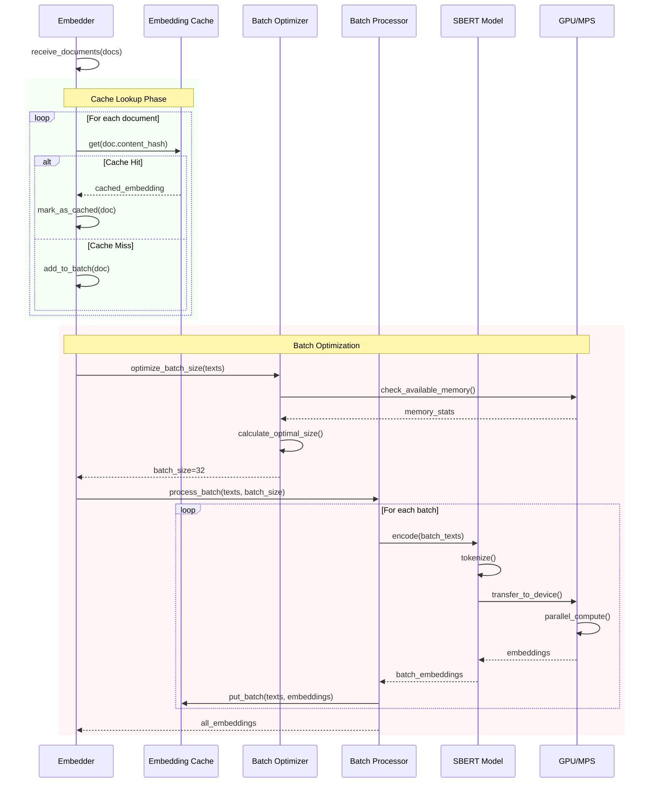

### 2.2 Multi-Model Embedding Strategy

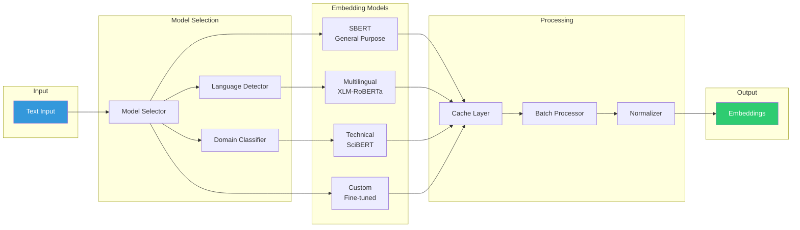

## 3. Retrieval Sub-Component Interactions

### 3.1 Hybrid Retrieval with Fusion

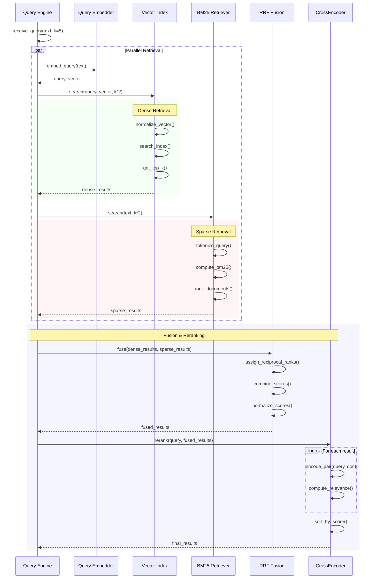

### 3.2 Vector Index Selection Strategy

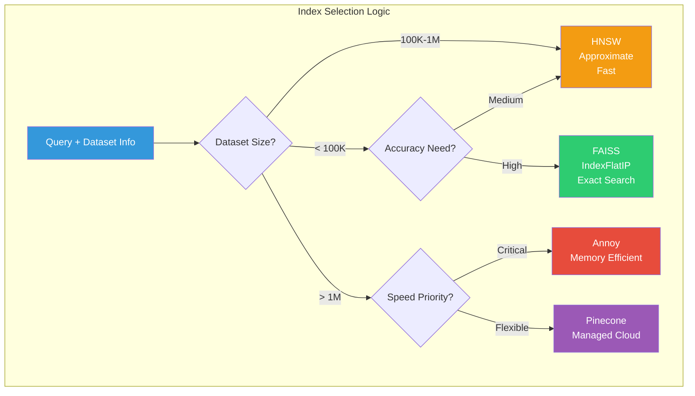

## 4. Answer Generation Sub-Component Interactions

### 4.1 Adaptive Prompt Building

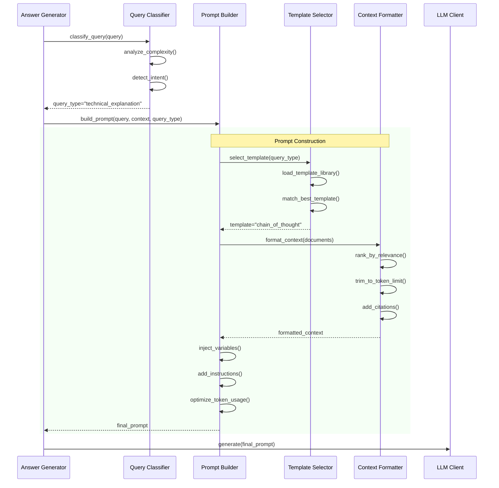

### 4.2 LLM Adapter Pattern Flow

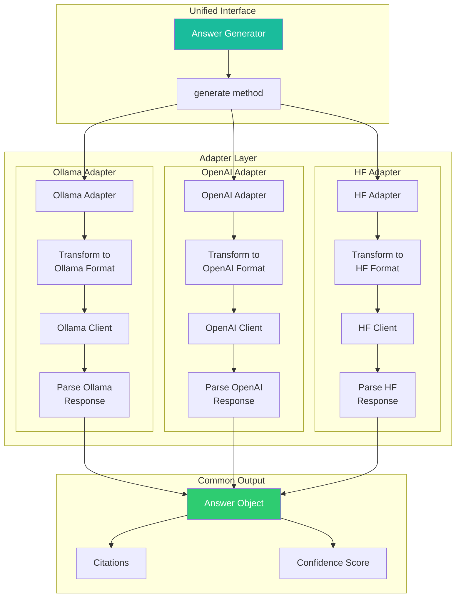

## 5. Monitoring & Health Check Interactions

### 5.1 Component Health Monitoring

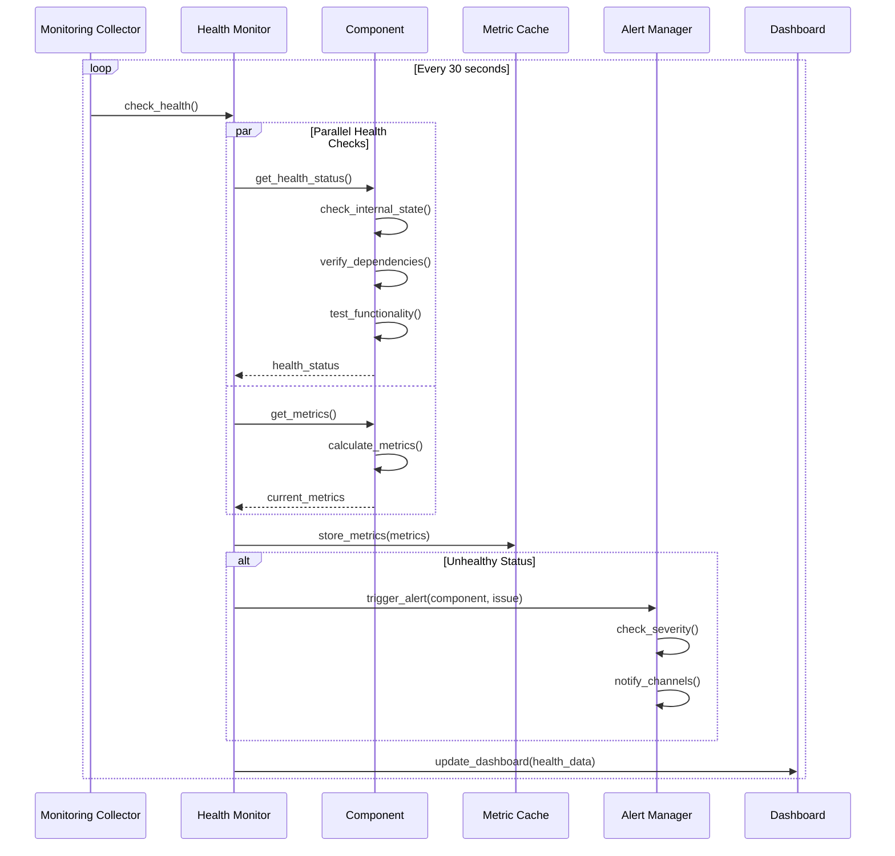

### 5.2 Performance Optimization Flow

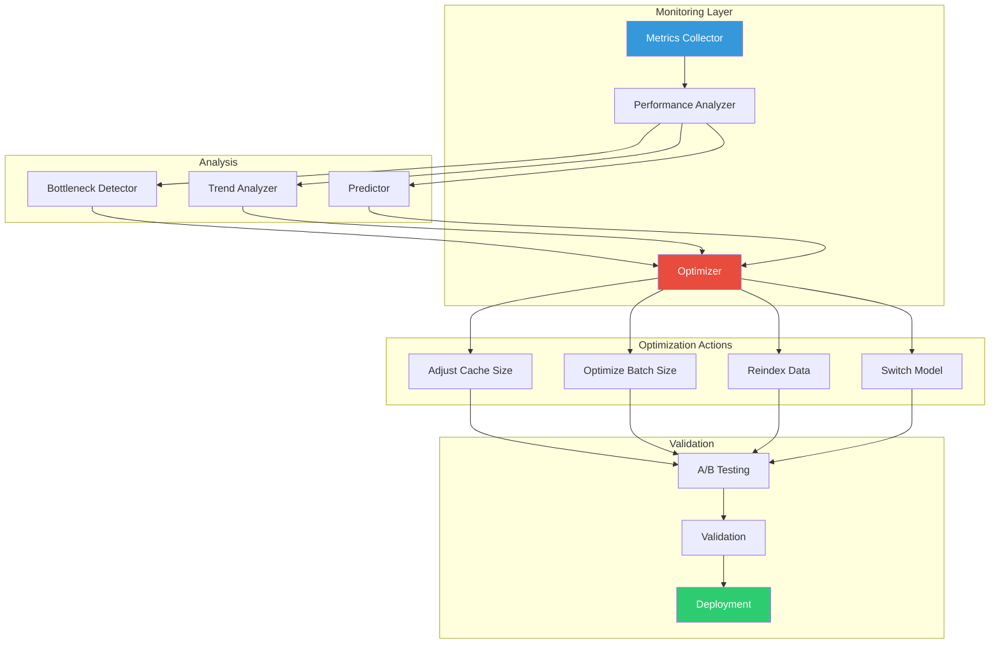

## 6. Configuration Management Flow

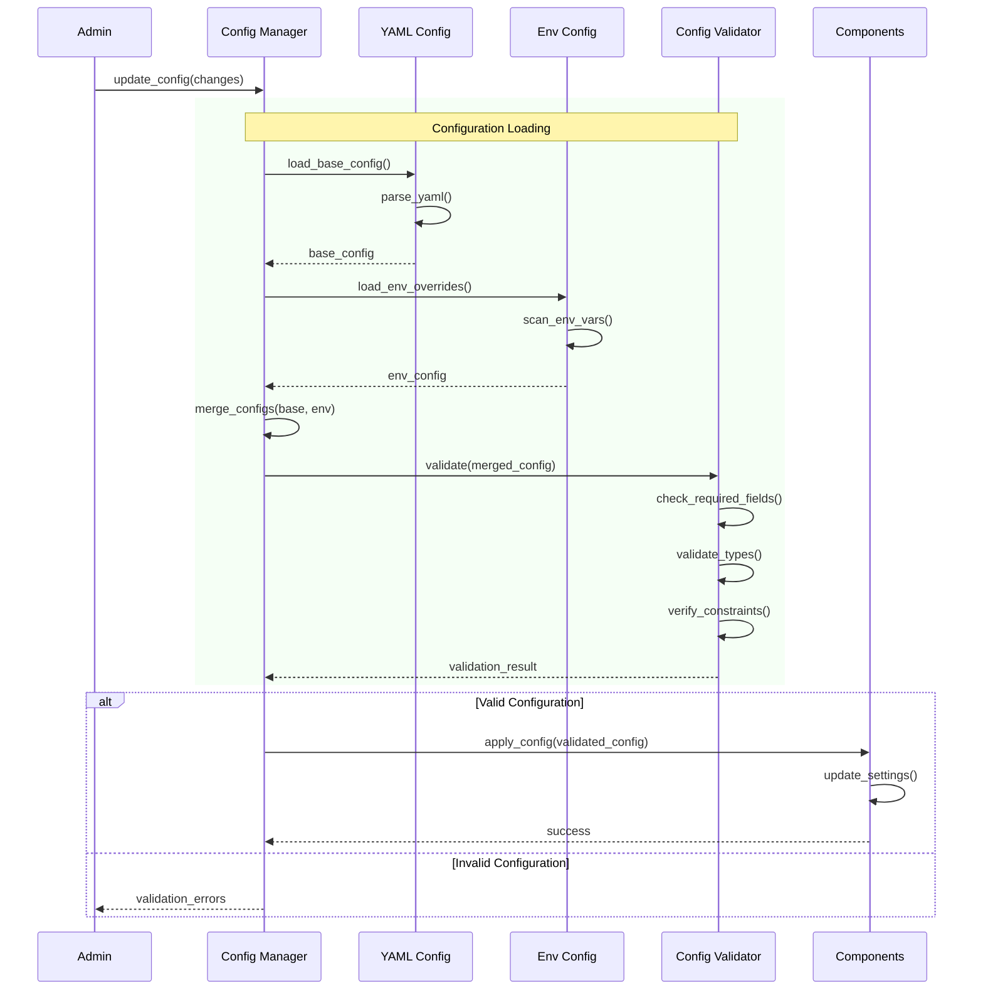