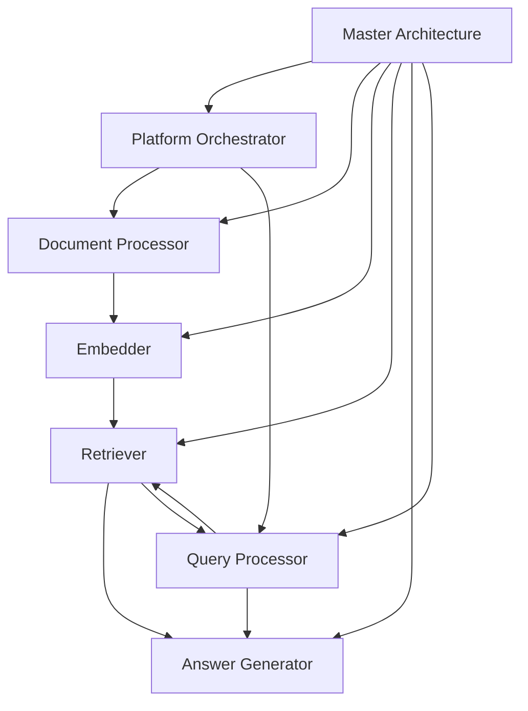

# Architecture Documentation Integration Guide

## 1. Project Structure Integration

### Current Project Structure
```
rag-portfolio/
├── project-1-technical-rag/
│   ├── src/
│   │   ├── core/
│   │   │   ├── interfaces.py
│   │   │   ├── platform_orchestrator.py
│   │   │   ├── query_processor.py
│   │   │   └── component_factory.py
│   │   ├── components/
│   │   │   ├── processors/
│   │   │   ├── embedders/
│   │   │   ├── retrievers/
│   │   │   └── generators/
│   │   └── shared_utils/
│   ├── tests/
│   ├── configs/
│   └── docs/                    # Existing documentation
│       ├── rag-architecture-requirements.md
│       ├── SOFTWARE_ARCHITECTURE_DOCUMENT.md
│       └── CONSOLIDATED_ARCHITECTURE_SUMMARY.md
```

### Proposed Documentation Structure
```
rag-portfolio/
├── project-1-technical-rag/
│   └── docs/
│       ├── architecture/        # NEW: Architecture documentation suite
│       │   ├── README.md        # Navigation and overview
│       │   ├── MASTER-ARCHITECTURE.md
│       │   ├── components/
│       │   │   ├── COMPONENT-1-PLATFORM-ORCHESTRATOR.md
│       │   │   ├── COMPONENT-2-DOCUMENT-PROCESSOR.md
│       │   │   ├── COMPONENT-3-EMBEDDER.md
│       │   │   ├── COMPONENT-4-RETRIEVER.md
│       │   │   ├── COMPONENT-5-ANSWER-GENERATOR.md
│       │   │   └── COMPONENT-6-QUERY-PROCESSOR.md
│       │   └── diagrams/        # Link to your generated diagrams
│       │       ├── rag-architecture-diagram.md
│       │       ├── rag-main-sequences.md
│       │       ├── rag-component-architectures.md
│       │       └── rag-interface-reference.md
│       ├── implementation/      # Existing implementation docs
│       ├── guides/             # How-to guides
│       └── decisions/          # Architecture Decision Records (ADRs)
```

---

## 2. Documentation Navigation (README.md)

Create `docs/architecture/README.md`:

```markdown
# RAG System Architecture Documentation

## Quick Navigation

### 🏗️ Architecture Overview
- [Master Architecture Specification](./MASTER-ARCHITECTURE.md) - Start here!
- [System Diagrams](./diagrams/rag-architecture-diagram.md)
- [Interface Reference](./diagrams/rag-interface-reference.md)

### 📦 Component Specifications
1. [Platform Orchestrator](./components/COMPONENT-1-PLATFORM-ORCHESTRATOR.md) - System coordination
2. [Document Processor](./components/COMPONENT-2-DOCUMENT-PROCESSOR.md) - Document handling
3. [Embedder](./components/COMPONENT-3-EMBEDDER.md) - Text vectorization
4. [Retriever](./components/COMPONENT-4-RETRIEVER.md) - Search & retrieval
5. [Answer Generator](./components/COMPONENT-5-ANSWER-GENERATOR.md) - Response generation
6. [Query Processor](./components/COMPONENT-6-QUERY-PROCESSOR.md) - Query workflow

### 🔄 Related Documentation
- [Implementation Details](../SOFTWARE_ARCHITECTURE_DOCUMENT.md)
- [Architecture Requirements](../rag-architecture-requirements.md)
- [Consolidated Summary](../CONSOLIDATED_ARCHITECTURE_SUMMARY.md)

## Reading Order

1. **For New Team Members**:
   - Master Architecture → Component 1 → Follow data flow

2. **For Component Developers**:
   - Master Architecture (Section 3) → Your component spec

3. **For System Architects**:
   - Master Architecture → All component design rationales

## Document Relationships


```

---

## 3. Code Integration

### 3.1 Component Documentation References

Add documentation references in component files:

```python
# src/core/platform_orchestrator.py
"""
Platform Orchestrator - Central system coordination.

Architecture Specification: docs/architecture/components/COMPONENT-1-PLATFORM-ORCHESTRATOR.md
Interface Reference: docs/architecture/diagrams/rag-interface-reference.md#platform-orchestrator
"""

# src/components/generators/adaptive_generator.py
"""
Adaptive Answer Generator with multi-provider support.

Architecture Specification: docs/architecture/components/COMPONENT-5-ANSWER-GENERATOR.md
Adapter Pattern Rationale: docs/architecture/MASTER-ARCHITECTURE.md#adapter-pattern-guidelines
"""
```

### 3.2 Configuration Documentation Links

```yaml
# configs/config.yaml
# Configuration schema documentation: docs/architecture/MASTER-ARCHITECTURE.md#configuration-management
# Component-specific configuration: See individual component docs in docs/architecture/components/

system:
  name: "technical-docs-rag"
  # ... configuration
```

### 3.3 Test Documentation References

```python
# tests/integration/test_full_pipeline.py
"""
Full pipeline integration tests.

Test scenarios based on: docs/architecture/diagrams/rag-main-sequences.md
Component interactions: docs/architecture/MASTER-ARCHITECTURE.md#integration-patterns
"""
```

---

## 4. Development Workflow Integration

### 4.1 Architecture Decision Records (ADRs)

Create `docs/decisions/` for tracking architecture decisions:

```markdown
# docs/decisions/001-six-component-architecture.md
# Decision: Adopt Six-Component Architecture

Status: Accepted
Date: 2025-01-15

## Context
[Link to MASTER-ARCHITECTURE.md#six-component-model]

## Decision
We will use a simplified 6-component architecture...

## Consequences
See component specifications in docs/architecture/components/
```

### 4.2 Component Development Guide

Create `docs/guides/component-development.md`:

```markdown
# Component Development Guide

## Before You Start
1. Read [Master Architecture](../architecture/MASTER-ARCHITECTURE.md)
2. Review your [Component Specification](../architecture/components/)
3. Understand [Interface Contracts](../architecture/diagrams/rag-interface-reference.md)

## Development Process
1. Follow the architecture specification
2. Implement interfaces exactly as defined
3. Use appropriate patterns (adapter/direct)
4. Add comprehensive tests
5. Update documentation if needed
```

---

## 5. CI/CD Integration

### 5.1 Documentation Validation

Add to `.github/workflows/docs.yml`:

```yaml
name: Documentation Checks

on: [push, pull_request]

jobs:
  check-links:
    runs-on: ubuntu-latest
    steps:
    - uses: actions/checkout@v2
    - name: Check markdown links
      uses: gaurav-nelson/github-action-markdown-link-check@v1
      with:
        folder-path: 'docs/architecture'
        
  check-references:
    runs-on: ubuntu-latest
    steps:
    - name: Verify component references
      run: |
        # Check that code references match documentation
        python scripts/check_doc_references.py
```

### 5.2 Architecture Compliance

```python
# scripts/check_architecture_compliance.py
"""
Verify implementation matches architecture specification.
"""

def check_component_interfaces():
    """Ensure all components implement specified interfaces."""
    # Read interface specs from docs/architecture/
    # Compare with actual implementations
    pass

def check_adapter_pattern_usage():
    """Verify adapter pattern is used where specified."""
    # Check components marked for adapter pattern
    # Verify implementation follows pattern
    pass
```

---

## 6. Documentation Maintenance

### 6.1 Version Control

```bash
# When updating architecture
git checkout -b update-retriever-architecture
# Edit docs/architecture/components/COMPONENT-4-RETRIEVER.md
# Update version number in document
git commit -m "docs: Update Retriever architecture for sparse search enhancement"
```

### 6.2 Review Process

1. **Architecture Changes**: Require review from tech lead
2. **Component Updates**: Require review from component owner
3. **Master Updates**: Require review from multiple stakeholders

### 6.3 Keeping Docs in Sync

```makefile
# Makefile
.PHONY: check-docs
check-docs:
	@echo "Checking documentation consistency..."
	@python scripts/check_doc_references.py
	@python scripts/validate_interfaces.py
	@echo "Documentation check complete"

.PHONY: update-docs
update-docs:
	@echo "Updating auto-generated sections..."
	@python scripts/generate_interface_docs.py
	@echo "Documentation update complete"
```

---

## 7. Team Usage Patterns

### 7.1 For Daily Development

```bash
# Quick component reference
cat docs/architecture/components/COMPONENT-3-EMBEDDER.md | grep -A5 "Best Practices"

# Find adapter pattern usage
grep -r "adapter" docs/architecture/components/

# Check interface definition
less docs/architecture/diagrams/rag-interface-reference.md
```

### 7.2 For Architecture Reviews

1. Start with changed component specification
2. Check impacts on related components
3. Verify master architecture compliance
4. Review interface changes

### 7.3 For Onboarding

Create onboarding checklist:
- [ ] Read MASTER-ARCHITECTURE.md
- [ ] Understand component responsibilities
- [ ] Review interface specifications
- [ ] Study sequence diagrams
- [ ] Examine your component's specification

---

## 8. External Documentation

### 8.1 API Documentation

Link architecture to API docs:

```python
# In API documentation
"""
## System Architecture

For detailed system architecture, see:
- [Master Architecture](./docs/architecture/MASTER-ARCHITECTURE.md)
- [Component Specifications](./docs/architecture/components/)

## API Design Principles

Based on architecture principles defined in:
[MASTER-ARCHITECTURE.md#interface-design-standards]
"""
```

### 8.2 README.md Updates

Update main project README:

```markdown
## Documentation

- 📚 [Architecture Documentation](./docs/architecture/) - System design and component specifications
- 🔧 [Implementation Guide](./docs/implementation/) - How to build and extend
- 📊 [Performance Analysis](./docs/performance/) - Benchmarks and optimization
- 🧪 [Testing Strategy](./docs/testing/) - Test approaches and coverage
```

---

## Quick Start Commands

```bash
# Navigate to architecture docs
cd docs/architecture

# Find specific component info
grep -n "Performance" components/COMPONENT-*.md

# Check cross-references
grep -r "MASTER-ARCHITECTURE.md" components/

# Validate all links
markdownlint **/*.md

# Generate component diagram
python scripts/generate_component_graph.py > diagrams/component-dependencies.md
```