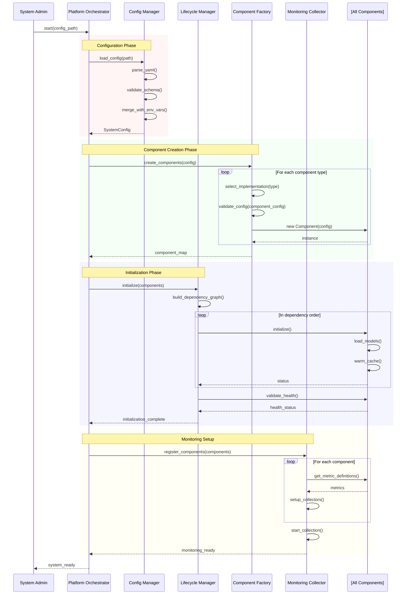
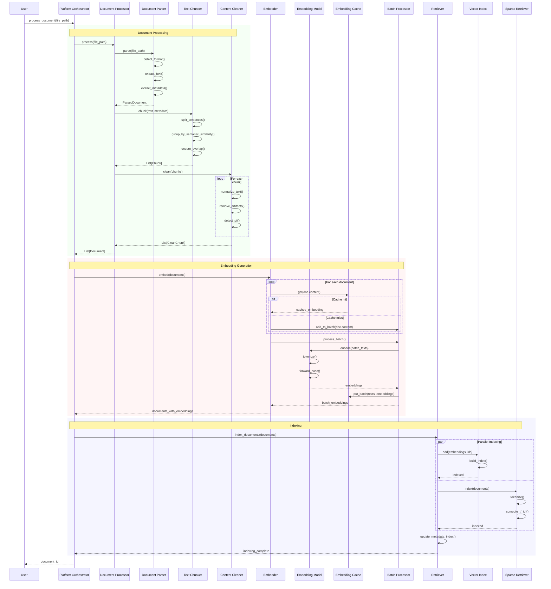
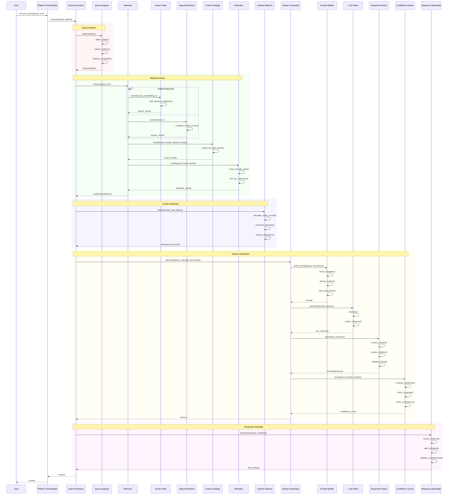
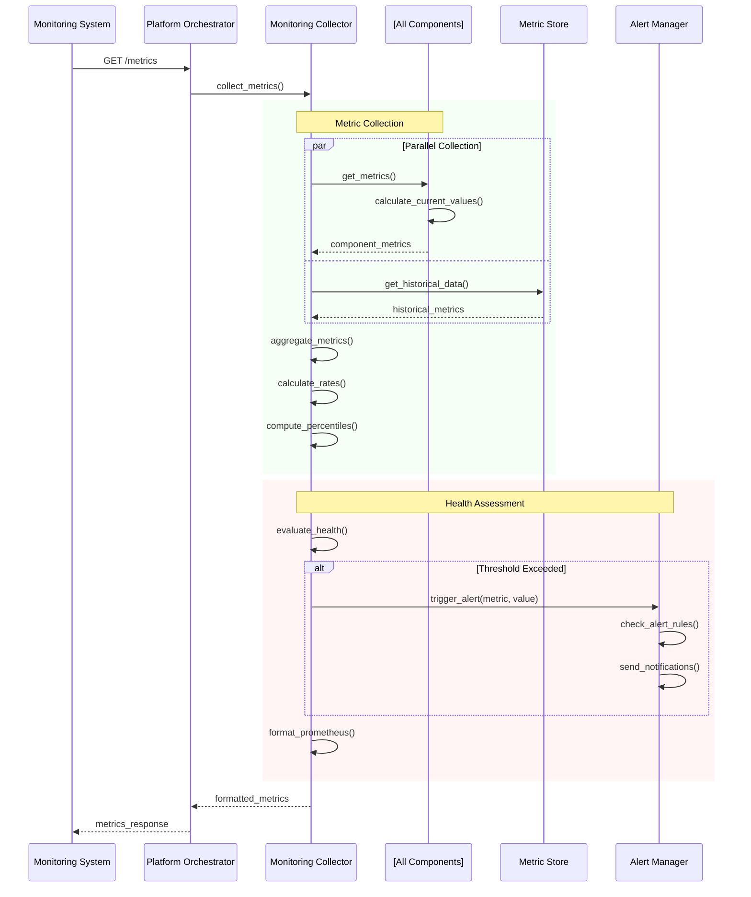

# RAG System - Main Use Case Sequence Diagrams

## 1. System Initialization Sequence

```mermaid
sequenceDiagram
    participant Admin as System Admin
    participant PO as Platform Orchestrator
    participant CM as Config Manager
    participant LM as Lifecycle Manager
    participant CF as Component Factory
    participant MC as Monitoring Collector
    participant Components as [All Components]

    Admin->>PO: start(config_path)
    
    rect rgb(255, 245, 245)
        Note over PO,CM: Configuration Phase
        PO->>CM: load_config(path)
        CM->>CM: parse_yaml()
        CM->>CM: validate_schema()
        CM->>CM: merge_with_env_vars()
        CM-->>PO: SystemConfig
    end
    
    rect rgb(245, 255, 245)
        Note over PO,CF: Component Creation Phase
        PO->>CF: create_components(config)
        
        loop For each component type
            CF->>CF: select_implementation(type)
            CF->>CF: validate_config(component_config)
            CF->>Components: new Component(config)
            Components-->>CF: instance
        end
        
        CF-->>PO: component_map
    end
    
    rect rgb(245, 245, 255)
        Note over PO,LM: Initialization Phase
        PO->>LM: initialize(components)
        LM->>LM: build_dependency_graph()
        
        loop In dependency order
            LM->>Components: initialize()
            Components->>Components: load_models()
            Components->>Components: warm_cache()
            Components-->>LM: status
        end
        
        LM->>Components: validate_health()
        Components-->>LM: health_status
        LM-->>PO: initialization_complete
    end
    
    rect rgb(255, 255, 245)
        Note over PO,MC: Monitoring Setup
        PO->>MC: register_components(components)
        
        loop For each component
            MC->>Components: get_metric_definitions()
            Components-->>MC: metrics
            MC->>MC: setup_collectors()
        end
        
        MC->>MC: start_collection()
        MC-->>PO: monitoring_ready
    end
    
    PO-->>Admin: system_ready
```

## 2. Document Processing Sequence

```mermaid
sequenceDiagram
    participant User
    participant PO as Platform Orchestrator
    participant DP as Document Processor
    participant Parser as Document Parser
    participant Chunker as Text Chunker
    participant Cleaner as Content Cleaner
    participant EMB as Embedder
    participant Model as Embedding Model
    participant Cache as Embedding Cache
    participant Batch as Batch Processor
    participant RET as Retriever
    participant VecIdx as Vector Index
    participant Sparse as Sparse Retriever

    User->>PO: process_document(file_path)
    
    rect rgb(245, 255, 245)
        Note over PO,Cleaner: Document Processing
        PO->>DP: process(file_path)
        
        DP->>Parser: parse(file_path)
        Parser->>Parser: detect_format()
        Parser->>Parser: extract_text()
        Parser->>Parser: extract_metadata()
        Parser-->>DP: ParsedDocument
        
        DP->>Chunker: chunk(text, metadata)
        Chunker->>Chunker: split_sentences()
        Chunker->>Chunker: group_by_semantic_similarity()
        Chunker->>Chunker: ensure_overlap()
        Chunker-->>DP: List[Chunk]
        
        DP->>Cleaner: clean(chunks)
        loop For each chunk
            Cleaner->>Cleaner: normalize_text()
            Cleaner->>Cleaner: remove_artifacts()
            Cleaner->>Cleaner: detect_pii()
        end
        Cleaner-->>DP: List[CleanChunk]
        
        DP-->>PO: List[Document]
    end
    
    rect rgb(255, 245, 245)
        Note over PO,Batch: Embedding Generation
        PO->>EMB: embed(documents)
        
        loop For each document
            EMB->>Cache: get(doc.content)
            alt Cache hit
                Cache-->>EMB: cached_embedding
            else Cache miss
                EMB->>Batch: add_to_batch(doc.content)
            end
        end
        
        EMB->>Batch: process_batch()
        Batch->>Model: encode(batch_texts)
        Model->>Model: tokenize()
        Model->>Model: forward_pass()
        Model-->>Batch: embeddings
        
        Batch->>Cache: put_batch(texts, embeddings)
        Batch-->>EMB: batch_embeddings
        
        EMB-->>PO: documents_with_embeddings
    end
    
    rect rgb(245, 245, 255)
        Note over PO,Sparse: Indexing
        PO->>RET: index_documents(documents)
        
        par Parallel Indexing
            RET->>VecIdx: add(embeddings, ids)
            VecIdx->>VecIdx: build_index()
            VecIdx-->>RET: indexed
        and
            RET->>Sparse: index(documents)
            Sparse->>Sparse: tokenize()
            Sparse->>Sparse: compute_tf_idf()
            Sparse-->>RET: indexed
        end
        
        RET->>RET: update_metadata_index()
        RET-->>PO: indexing_complete
    end
    
    PO-->>User: document_id
```

## 3. Query Processing Sequence

```mermaid
sequenceDiagram
    participant User
    participant PO as Platform Orchestrator
    participant QP as Query Processor
    participant QA as Query Analyzer
    participant RET as Retriever
    participant VecIdx as Vector Index
    participant Sparse as Sparse Retriever
    participant Fusion as Fusion Strategy
    participant Rerank as Reranker
    participant CS as Context Selector
    participant AG as Answer Generator
    participant PB as Prompt Builder
    participant LLM as LLM Client
    participant RP as Response Parser
    participant Conf as Confidence Scorer
    participant RA as Response Assembler

    User->>PO: process_query(query, k=5)
    PO->>QP: process(query, options)
    
    rect rgb(255, 245, 245)
        Note over QP,QA: Query Analysis
        QP->>QA: analyze(query)
        QA->>QA: detect_intent()
        QA->>QA: extract_entities()
        QA->>QA: classify_complexity()
        QA-->>QP: QueryAnalysis
    end
    
    rect rgb(245, 255, 245)
        Note over QP,Rerank: Retrieval Phase
        QP->>RET: retrieve(query, k*2)
        
        par Hybrid Retrieval
            RET->>VecIdx: search(query_embedding, k)
            VecIdx->>VecIdx: find_nearest_neighbors()
            VecIdx-->>RET: dense_results
        and
            RET->>Sparse: search(query, k)
            Sparse->>Sparse: compute_bm25_scores()
            Sparse-->>RET: sparse_results
        end
        
        RET->>Fusion: fuse([dense_results, sparse_results])
        Fusion->>Fusion: reciprocal_rank_fusion()
        Fusion-->>RET: fused_results
        
        RET->>Rerank: rerank(query, fused_results)
        Rerank->>Rerank: cross_encode_pairs()
        Rerank->>Rerank: sort_by_relevance()
        Rerank-->>RET: reranked_results
        
        RET-->>QP: List[RetrievalResult]
    end
    
    rect rgb(245, 245, 255)
        Note over QP,CS: Context Selection
        QP->>CS: select(results, max_tokens)
        CS->>CS: calculate_token_counts()
        CS->>CS: maximize_diversity()
        CS->>CS: ensure_relevance()
        CS-->>QP: selected_documents
    end
    
    rect rgb(255, 255, 245)
        Note over QP,Conf: Answer Generation
        QP->>AG: generate(query, selected_documents)
        
        AG->>PB: build_prompt(query, documents)
        PB->>PB: select_template()
        PB->>PB: format_context()
        PB->>PB: add_instructions()
        PB-->>AG: prompt
        
        AG->>LLM: generate(prompt, params)
        LLM->>LLM: tokenize()
        LLM->>LLM: model_inference()
        LLM-->>AG: raw_response
        
        AG->>RP: parse(raw_response)
        RP->>RP: extract_answer()
        RP->>RP: extract_citations()
        RP->>RP: validate_format()
        RP-->>AG: ParsedResponse
        
        AG->>Conf: score(query, answer, context)
        Conf->>Conf: compute_perplexity()
        Conf->>Conf: check_coverage()
        Conf->>Conf: verify_consistency()
        Conf-->>AG: confidence_score
        
        AG-->>QP: Answer
    end
    
    rect rgb(255, 245, 255)
        Note over QP,RA: Response Assembly
        QP->>RA: assemble(answer, metadata)
        RA->>RA: format_citations()
        RA->>RA: add_metadata()
        RA->>RA: validate_completeness()
        RA-->>QP: final_answer
    end
    
    QP-->>PO: Answer
    PO-->>User: Answer
```

## 4. System Monitoring Sequence

```mermaid
sequenceDiagram
    participant Monitor as Monitoring System
    participant PO as Platform Orchestrator
    participant MC as Monitoring Collector
    participant Components as [All Components]
    participant Metrics as Metric Store
    participant Alerts as Alert Manager

    Monitor->>PO: GET /metrics
    
    PO->>MC: collect_metrics()
    
    rect rgb(245, 255, 245)
        Note over MC,Components: Metric Collection
        
        par Parallel Collection
            MC->>Components: get_metrics()
            Components->>Components: calculate_current_values()
            Components-->>MC: component_metrics
        and
            MC->>Metrics: get_historical_data()
            Metrics-->>MC: historical_metrics
        end
        
        MC->>MC: aggregate_metrics()
        MC->>MC: calculate_rates()
        MC->>MC: compute_percentiles()
    end
    
    rect rgb(255, 245, 245)
        Note over MC,Alerts: Health Assessment
        
        MC->>MC: evaluate_health()
        
        alt Threshold Exceeded
            MC->>Alerts: trigger_alert(metric, value)
            Alerts->>Alerts: check_alert_rules()
            Alerts->>Alerts: send_notifications()
        end
        
        MC->>MC: format_prometheus()
    end
    
    MC-->>PO: formatted_metrics
    PO-->>Monitor: metrics_response
```