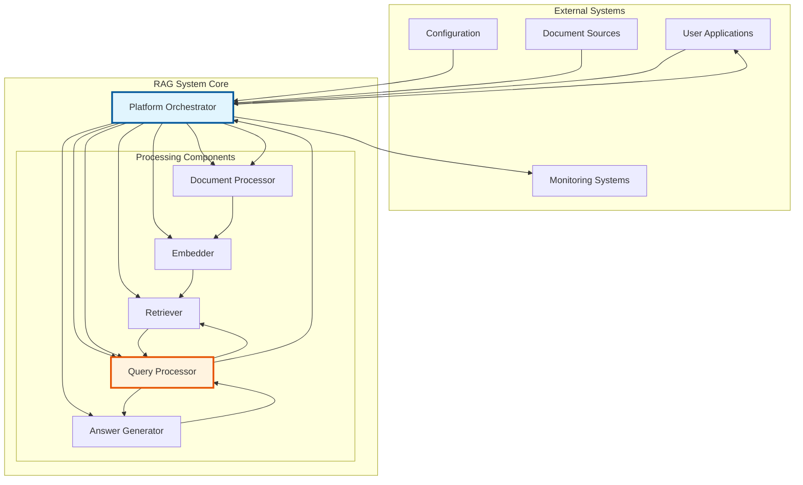
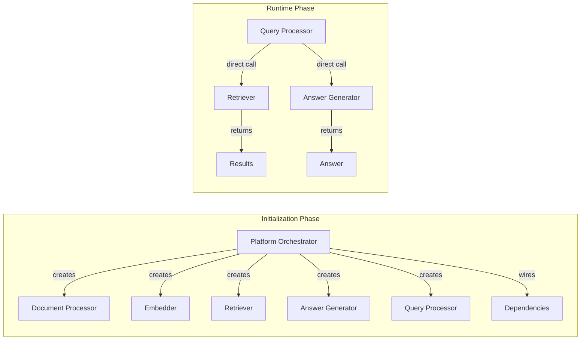
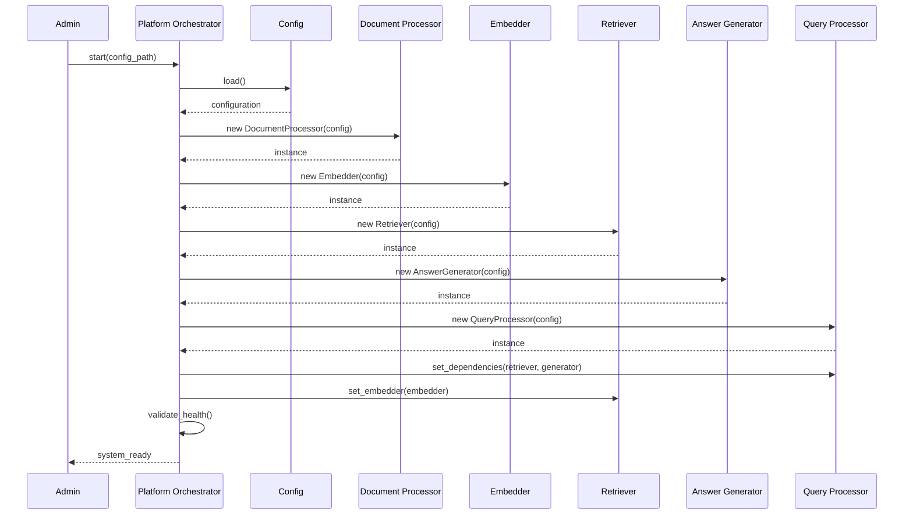
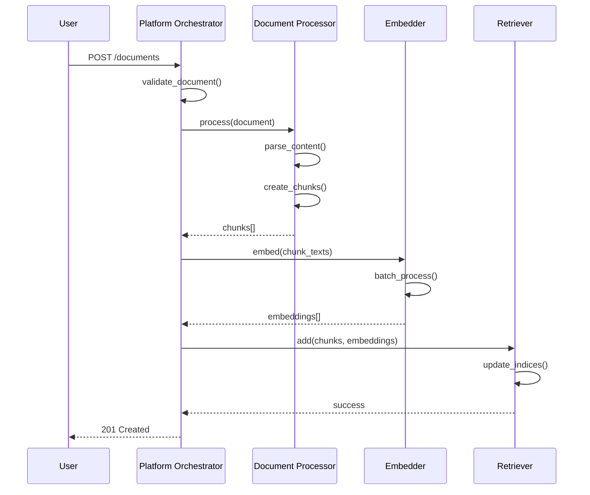
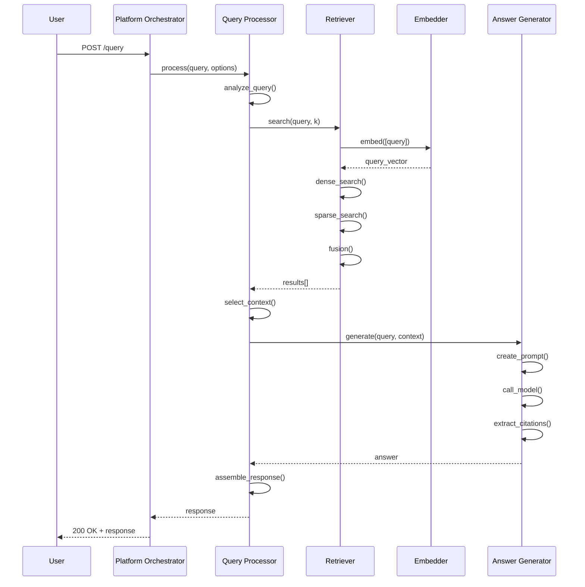
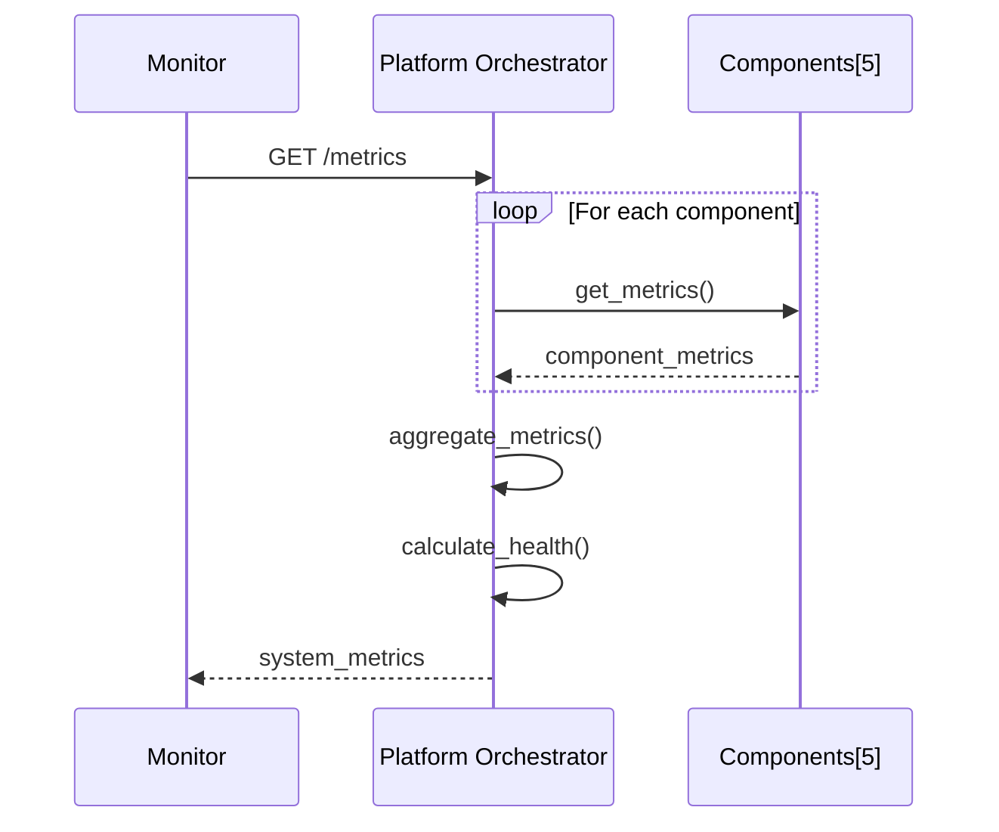
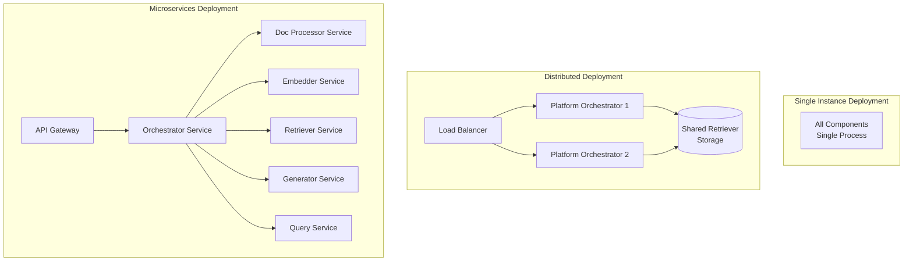

# RAG System Architecture Requirements Specification

**Document Version**: 1.0  
**Date**: July 2025  
**Status**: Final  
**Classification**: Technical Architecture

## Table of Contents

1. [Executive Summary](#1-executive-summary)
2. [Architecture Overview](#2-architecture-overview)
3. [Component Specifications](#3-component-specifications)
4. [Interface Definitions](#4-interface-definitions)
5. [Use Case Scenarios](#5-use-case-scenarios)
6. [Sequence Diagrams](#6-sequence-diagrams)
7. [Quality Attributes](#7-quality-attributes)
8. [Deployment Considerations](#8-deployment-considerations)

---

## 1. Executive Summary

### 1.1 Purpose

This document defines the architecture requirements for a production-grade Retrieval-Augmented Generation (RAG) system based on a simplified 6-component model that prioritizes clarity, maintainability, and performance.

### 1.2 Core Principles

- **Build-time Configuration, Runtime Simplicity**: Component selection and configuration happen at initialization; runtime uses direct references
- **Single Responsibility**: Each component has one clear purpose
- **Direct Wiring**: Components interact through direct method calls, not abstract factories
- **Platform Agnostic Core**: Business logic separated from platform-specific concerns

### 1.3 Component Model

The system consists of six core components:

1. **Platform Orchestrator**: System lifecycle and platform integration
2. **Document Processor**: Document transformation and chunking
3. **Embedder**: Text-to-vector conversion
4. **Retriever**: Information storage and retrieval
5. **Answer Generator**: Response generation from context
6. **Query Processor**: Query execution workflow

---

## 2. Architecture Overview

### 2.1 High-Level Architecture



### 2.2 Component Interaction Model



---

## 3. Component Specifications

### 3.1 Platform Orchestrator

**Responsibility**: System lifecycle management and platform integration

**Key Functions**:
- Component initialization and dependency injection
- Configuration management
- Platform-specific adaptations (cloud, on-premise, edge)
- System health monitoring
- Resource management
- API exposure and routing

**Interfaces Provided**:
- System initialization
- Document ingestion coordination
- Query request handling
- Health and metrics endpoints
- Configuration updates

**Dependencies**: None (top-level component)

### 3.2 Document Processor

**Responsibility**: Transform raw documents into searchable chunks

**Key Functions**:
- Multi-format document parsing (PDF, DOCX, HTML, etc.)
- Intelligent text chunking with configurable strategies
- Metadata extraction and preservation
- Content cleaning and normalization
- Structure preservation (headers, sections, tables)

**Interfaces Provided**:
- `process(document: Document) → List[Chunk]`
- `get_supported_formats() → List[str]`

**Dependencies**: None

### 3.3 Embedder

**Responsibility**: Convert text into vector representations

**Key Functions**:
- Text-to-vector transformation
- Batch processing optimization
- Model management and caching
- Dimension consistency enforcement
- Hardware acceleration support (GPU/MPS)

**Interfaces Provided**:
- `embed(texts: List[str]) → VectorArray`
- `get_dimension() → int`
- `get_model_info() → ModelInfo`

**Dependencies**: None

### 3.4 Retriever

**Responsibility**: Store and retrieve relevant information

**Key Functions**:
- Vector index management
- Hybrid search capabilities (dense + sparse)
- Result ranking and fusion
- Index persistence and recovery
- Metadata filtering
- Incremental updates

**Interfaces Provided**:
- `add(chunks: List[Chunk], embeddings: VectorArray) → None`
- `search(query: str, k: int, filters: Dict) → List[Result]`
- `update(chunk_id: str, chunk: Chunk) → None`
- `delete(chunk_id: str) → None`
- `get_stats() → IndexStats`

**Dependencies**: Embedder (for query embedding)

### 3.5 Answer Generator

**Responsibility**: Generate coherent answers from retrieved context

**Key Functions**:
- Context-aware response generation
- Multiple backend support (API/local models)
- Prompt template management
- Citation extraction and formatting
- Response quality scoring
- Token management

**Interfaces Provided**:
- `generate(query: str, context: List[Chunk]) → Answer`
- `validate_context(context: List[Chunk]) → bool`
- `get_model_info() → ModelInfo`

**Dependencies**: None

### 3.6 Query Processor

**Responsibility**: Execute query workflow

**Key Functions**:
- Query analysis and enhancement
- Retrieval orchestration
- Context selection and ranking
- Answer generation coordination
- Response assembly
- Query caching (optional)

**Interfaces Provided**:
- `process(query: str, options: QueryOptions) → Response`
- `explain_query(query: str) → QueryPlan`

**Dependencies**: Retriever, Answer Generator

---

## 4. Interface Definitions

### 4.1 Data Types

```yaml
# Core Data Types
Document:
  id: string
  content: bytes
  format: string
  metadata: Dict[str, Any]
  source: string

Chunk:
  id: string
  content: string
  metadata: Dict[str, Any]
  source_document_id: string
  position: ChunkPosition

ChunkPosition:
  start: int
  end: int
  page: Optional[int]
  section: Optional[string]

VectorArray:
  vectors: float[][]
  dimension: int

Result:
  chunk: Chunk
  score: float
  method: string  # "dense", "sparse", "hybrid"

Answer:
  text: string
  citations: List[Citation]
  confidence: float
  metadata: Dict[str, Any]

Citation:
  chunk_id: string
  text: string
  score: float

Response:
  answer: Answer
  sources: List[Chunk]
  query_metadata: Dict[str, Any]
```

### 4.2 Configuration Schema

```yaml
# System Configuration Schema
system:
  name: string
  version: string
  environment: string  # "development", "production", "test"

components:
  document_processor:
    class: string
    config:
      chunk_size: int
      chunk_overlap: int
      preserve_structure: bool
      
  embedder:
    class: string
    config:
      model: string
      device: string  # "cpu", "cuda", "mps"
      batch_size: int
      
  retriever:
    class: string
    config:
      index_type: string
      dense_weight: float
      sparse_weight: float
      
  answer_generator:
    class: string
    config:
      backend: string
      model: string
      max_tokens: int
      temperature: float
      
  query_processor:
    class: string
    config:
      retrieval_k: int
      rerank: bool
      cache_enabled: bool

platform:
  api:
    port: int
    workers: int
  monitoring:
    enabled: bool
    endpoint: string
  storage:
    type: string
    path: string
```

---

## 5. Use Case Scenarios

### 5.1 System Initialization

**Actors**: System Administrator, Platform Orchestrator

**Preconditions**: Valid configuration file exists

**Flow**:
1. Administrator starts system with configuration
2. Platform Orchestrator loads configuration
3. Platform Orchestrator instantiates each component
4. Platform Orchestrator wires component dependencies
5. Platform Orchestrator validates component health
6. System ready for operations

**Postconditions**: System operational with all components initialized

### 5.2 Document Ingestion

**Actors**: User, Platform Orchestrator, Document Processor, Embedder, Retriever

**Preconditions**: System initialized, valid document provided

**Flow**:
1. User submits document through API
2. Platform Orchestrator validates document
3. Platform Orchestrator invokes Document Processor
4. Document Processor creates chunks
5. Platform Orchestrator passes chunks to Embedder
6. Embedder generates vectors
7. Platform Orchestrator passes chunks and vectors to Retriever
8. Retriever indexes content
9. Platform Orchestrator returns success status

**Postconditions**: Document indexed and searchable

### 5.3 Query Processing

**Actors**: User, Platform Orchestrator, Query Processor, Retriever, Answer Generator

**Preconditions**: System initialized, documents indexed

**Flow**:
1. User submits query
2. Platform Orchestrator routes to Query Processor
3. Query Processor analyzes query
4. Query Processor requests retrieval from Retriever
5. Retriever returns relevant chunks
6. Query Processor passes query and context to Answer Generator
7. Answer Generator creates response
8. Query Processor assembles final response
9. Platform Orchestrator returns response to user

**Postconditions**: User receives answer with citations

### 5.4 System Monitoring

**Actors**: Monitoring System, Platform Orchestrator, All Components

**Preconditions**: System operational, monitoring enabled

**Flow**:
1. Monitoring system requests metrics
2. Platform Orchestrator collects metrics from each component
3. Components return performance data
4. Platform Orchestrator aggregates metrics
5. Platform Orchestrator returns monitoring data

**Postconditions**: Current system metrics available

---

## 6. Sequence Diagrams

### 6.1 System Initialization Sequence



### 6.2 Document Ingestion Sequence



### 6.3 Query Processing Sequence



### 6.4 Monitoring Sequence



---

## 7. Quality Attributes

### 7.1 Performance Requirements

| Attribute | Requirement | Measurement |
|-----------|------------|-------------|
| **Document Processing** | <1s per page | 95th percentile |
| **Embedding Generation** | >100 texts/second | Throughput |
| **Retrieval Latency** | <50ms | 95th percentile |
| **Answer Generation** | <10s | 95th percentile |
| **End-to-end Query** | <12s | 95th percentile |

### 7.2 Scalability Requirements

- **Document Volume**: Support 1M+ documents
- **Query Throughput**: 100+ QPS sustained
- **Concurrent Users**: 1000+ simultaneous
- **Index Size**: 10GB+ vectors

### 7.3 Reliability Requirements

- **Availability**: 99.9% uptime
- **Error Rate**: <0.1% failed queries
- **Recovery Time**: <5 minutes
- **Data Durability**: No data loss

### 7.4 Security Requirements

- **Authentication**: API key or OAuth2
- **Authorization**: Role-based access
- **Encryption**: TLS for transit, AES for storage
- **Audit**: All operations logged

### 7.5 Maintainability Requirements

- **Component Independence**: Update components without system downtime
- **Configuration Changes**: Hot-reload capable
- **Monitoring**: Comprehensive metrics exposed
- **Debugging**: Detailed logging and tracing

---

## 8. Deployment Considerations

### 8.1 Deployment Patterns



### 8.2 Infrastructure Requirements

| Component | CPU | Memory | GPU | Storage |
|-----------|-----|--------|-----|---------|
| Platform Orchestrator | 2 cores | 4GB | None | 10GB |
| Document Processor | 4 cores | 8GB | None | 50GB |
| Embedder | 4 cores | 16GB | Optional | 20GB |
| Retriever | 8 cores | 32GB | None | 100GB+ |
| Answer Generator | 8 cores | 32GB | Recommended | 50GB |
| Query Processor | 4 cores | 8GB | None | 10GB |

### 8.3 Platform-Specific Adaptations

**Cloud Deployment (AWS/Azure/GCP)**:
- Use managed services for vector storage
- Auto-scaling groups for components
- Managed load balancers
- Cloud-native monitoring

**On-Premise Deployment**:
- Hardware optimization focus
- Local storage strategies
- Private model hosting
- Internal monitoring systems

**Edge Deployment**:
- Lightweight component variants
- Reduced model sizes
- Local-only operation
- Minimal resource usage

### 8.4 Configuration Management

```yaml
# Environment-specific overrides
production:
  components:
    retriever:
      config:
        index_type: "distributed"
        replicas: 3
    answer_generator:
      config:
        backend: "cuda"
        model: "production-optimized"
        
development:
  components:
    all:
      config:
        debug: true
        cache_enabled: false
```

---

## Appendix A: Glossary

| Term | Definition |
|------|------------|
| **Chunk** | A segment of a document suitable for embedding and retrieval |
| **Dense Search** | Vector similarity-based retrieval |
| **Sparse Search** | Keyword/token-based retrieval |
| **Hybrid Search** | Combination of dense and sparse retrieval |
| **Direct Wiring** | Components hold concrete references to dependencies |
| **Platform Orchestrator** | Top-level component managing system lifecycle |

## Appendix B: References

1. Industry RAG Architectures Guide (2024-2025)
2. Anthropic's Contextual Retrieval
3. Microsoft's Azure AI Search Architecture
4. LangChain Architecture Patterns
5. Production ML Systems Design

---

**Document Control**

| Version | Date | Author | Changes |
|---------|------|--------|---------|
| 1.0 | July 2025 | Architecture Team | Initial version |