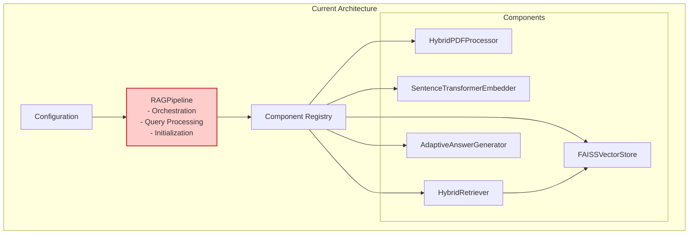
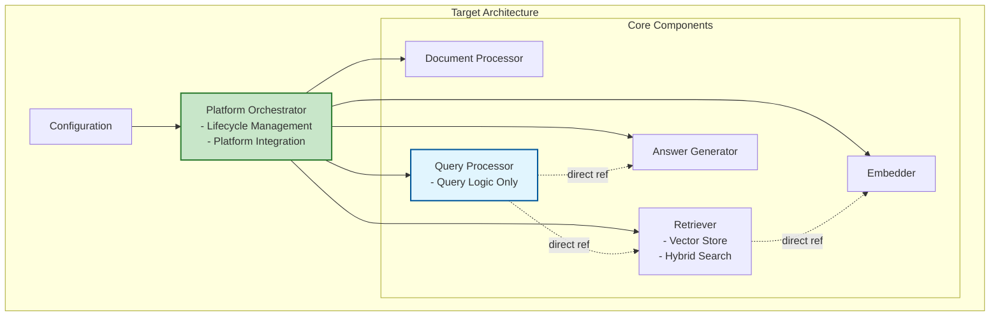
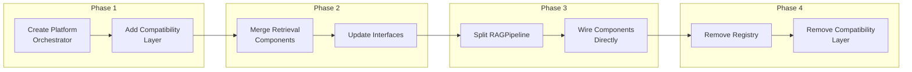
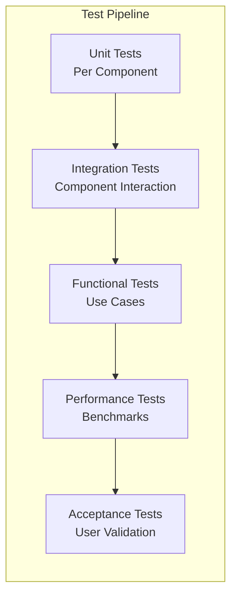
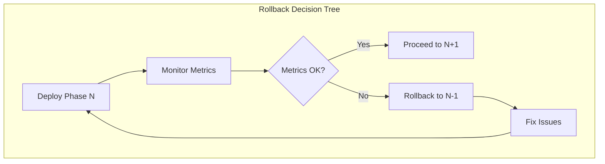
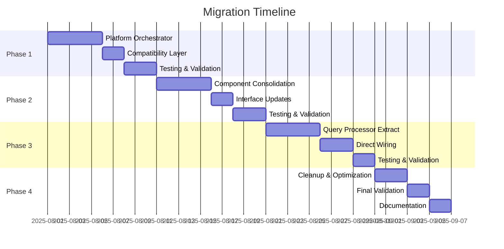

# RAG Architecture Migration Plan

**Document Version**: 1.0  
**Date**: July 2025  
**Status**: Final  
**Classification**: Technical Implementation

## Table of Contents

1. [Executive Summary](#1-executive-summary)
2. [Current State Analysis](#2-current-state-analysis)
3. [Target Architecture](#3-target-architecture)
4. [Migration Strategy](#4-migration-strategy)
5. [Implementation Phases](#5-implementation-phases)
6. [Risk Management](#6-risk-management)
7. [Testing Strategy](#7-testing-strategy)
8. [Rollback Procedures](#8-rollback-procedures)

---

## 1. Executive Summary

### 1.1 Purpose

This document outlines the migration strategy from the current modular RAG architecture to the refined 6-component architecture that separates platform orchestration from query processing.

### 1.2 Migration Goals

- **Separation of Concerns**: Extract platform/lifecycle management from query processing
- **Improved Clarity**: Each component has a single, clear responsibility
- **Backward Compatibility**: Ensure existing code continues to function
- **Minimal Disruption**: Phased migration with continuous operation

### 1.3 Key Changes

1. Create new **Platform Orchestrator** component
2. Transform **RAGPipeline** → **Query Processor** (query-only focus)
3. Consolidate **FAISSVectorStore** + **HybridRetriever** → unified **Retriever**
4. Update component interfaces for direct wiring
5. Simplify configuration system

---

## 2. Current State Analysis

### 2.1 Current Architecture Overview



### 2.2 Current Issues

| Issue | Description | Impact |
|-------|-------------|--------|
| **Mixed Responsibilities** | RAGPipeline handles both orchestration and query processing | Violates single responsibility principle |
| **Split Retrieval** | FAISSVectorStore and HybridRetriever artificially separated | Unnecessary complexity |
| **Registry Overhead** | Runtime component lookup through registry | Performance overhead, harder debugging |
| **Deep Abstractions** | Multiple adapter layers between interface and implementation | Complex stack traces |

### 2.3 Current Component Mapping

| Current Component | Maps To | Changes Required |
|-------------------|---------|------------------|
| RAGPipeline | Platform Orchestrator + Query Processor | Split into two components |
| HybridPDFProcessor | Document Processor | Rename, simplify interface |
| SentenceTransformerEmbedder | Embedder | Rename, simplify interface |
| FAISSVectorStore + HybridRetriever | Retriever | Merge into single component |
| AdaptiveAnswerGenerator | Answer Generator | Rename, simplify interface |
| ComponentRegistry | (Removed) | Replaced by direct wiring |

---

## 3. Target Architecture

### 3.1 Target Architecture Overview



### 3.2 Key Improvements

- **Clear Separation**: Platform concerns vs. business logic
- **Unified Retriever**: Single component for all retrieval needs
- **Direct Wiring**: Components hold concrete references
- **Simplified Interfaces**: Clean, purpose-driven APIs

---

## 4. Migration Strategy

### 4.1 Guiding Principles

1. **Incremental Migration**: Small, testable changes
2. **Backward Compatibility**: Maintain existing APIs during transition
3. **Feature Parity**: No functionality loss
4. **Continuous Operation**: System remains operational throughout

### 4.2 Migration Approach



---

## 5. Implementation Phases

### 5.1 Phase 1: Platform Orchestrator Introduction (Week 1)

**Objectives**:
- Create Platform Orchestrator component
- Add compatibility layer for existing code
- No breaking changes

**Tasks**:

1. **Create Platform Orchestrator**
   ```yaml
   New Files:
   - src/core/platform.py (PlatformOrchestrator class)
   - src/core/compatibility.py (Backward compatibility)
   ```

2. **Compatibility Layer**
   - RAGPipeline facade that delegates to new components
   - Maintains existing API signatures
   - Logs deprecation warnings

3. **Update Entry Points**
   - Modify main.py to use Platform Orchestrator
   - Keep existing APIs functional

**Validation**:
- All existing tests pass
- New Platform Orchestrator tests pass
- No breaking changes in API

### 5.2 Phase 2: Component Consolidation (Week 2)

**Objectives**:
- Merge FAISSVectorStore + HybridRetriever → Retriever
- Update component interfaces
- Maintain backward compatibility

**Tasks**:

1. **Create Unified Retriever**
   ```yaml
   Changes:
   - Create src/components/retriever.py
   - Merge functionality from FAISSVectorStore and HybridRetriever
   - Implement clean Retriever interface
   ```

2. **Update Component Interfaces**
   - Simplify to match architecture spec
   - Remove unnecessary abstraction layers
   - Add direct wiring support

3. **Update Tests**
   - Test unified Retriever
   - Ensure same functionality

**Validation**:
- Retrieval functionality unchanged
- Performance maintained or improved
- All tests pass

### 5.3 Phase 3: Query Processor Extraction (Week 3)

**Objectives**:
- Split RAGPipeline into Platform Orchestrator + Query Processor
- Implement direct component wiring
- Remove initialization logic from query path

**Tasks**:

1. **Extract Query Processor**
   ```yaml
   Changes:
   - Create src/core/query_processor.py
   - Move query logic from RAGPipeline
   - Remove orchestration responsibilities
   ```

2. **Direct Component Wiring**
   - Platform Orchestrator wires components at startup
   - Components hold direct references
   - No runtime lookups

3. **Update Configuration**
   - Simplify configuration structure
   - Remove registry configuration
   - Add platform-specific settings

**Validation**:
- Query processing unchanged
- Initialization faster
- Clean separation of concerns

### 5.4 Phase 4: Cleanup and Optimization (Week 4)

**Objectives**:
- Remove Component Registry
- Remove compatibility layer
- Optimize performance

**Tasks**:

1. **Remove Legacy Code**
   ```yaml
   Remove:
   - src/core/registry.py
   - src/core/compatibility.py
   - Adapter classes
   ```

2. **API Migration**
   - Update all client code
   - Update documentation
   - Final deprecation

3. **Performance Optimization**
   - Direct method calls
   - Remove indirection
   - Profile and optimize

**Validation**:
- All tests pass
- Performance improved
- Clean codebase

---

## 6. Risk Management

### 6.1 Risk Assessment

| Risk | Probability | Impact | Mitigation |
|------|------------|--------|------------|
| **Breaking Changes** | Medium | High | Compatibility layer, extensive testing |
| **Performance Regression** | Low | Medium | Performance benchmarks at each phase |
| **Data Loss** | Low | High | Backup before migration, validation scripts |
| **Downtime** | Low | Medium | Blue-green deployment, rollback plan |
| **Integration Issues** | Medium | Medium | Integration tests, staged rollout |

### 6.2 Risk Mitigation Strategies

1. **Compatibility Layer**
   - Maintains existing APIs during transition
   - Allows gradual migration of client code
   - Provides deprecation warnings

2. **Comprehensive Testing**
   - Unit tests for each component
   - Integration tests for workflows
   - Performance benchmarks
   - End-to-end validation

3. **Staged Rollout**
   - Test environment first
   - Canary deployment (10% traffic)
   - Progressive rollout
   - Monitor metrics closely

---

## 7. Testing Strategy

### 7.1 Test Phases



### 7.2 Test Coverage Requirements

| Test Type | Coverage Target | Focus Areas |
|-----------|----------------|-------------|
| Unit Tests | 90%+ | Component logic, edge cases |
| Integration Tests | Key workflows | Component interaction, data flow |
| Functional Tests | All use cases | Document ingestion, query processing |
| Performance Tests | Baseline + 10% | Latency, throughput, resource usage |
| Acceptance Tests | User scenarios | API compatibility, result quality |

### 7.3 Test Scenarios

1. **Backward Compatibility**
   ```python
   # Old API should continue working
   pipeline = RAGPipeline("config.yaml")  # Should work
   answer = pipeline.query("test")        # Should work
   ```

2. **New Architecture**
   ```python
   # New API should work
   orchestrator = PlatformOrchestrator("config.yaml")
   response = orchestrator.process_query("test")
   ```

3. **Performance Validation**
   - Query latency ≤ previous version
   - Memory usage ≤ previous version
   - Initialization time improved

---

## 8. Rollback Procedures

### 8.1 Rollback Strategy

Each phase includes rollback capability:



### 8.2 Rollback Procedures

**Phase 1 Rollback**:
1. Revert Platform Orchestrator changes
2. Restore original entry points
3. Remove compatibility layer
4. Verify system operation

**Phase 2 Rollback**:
1. Restore separate VectorStore/Retriever
2. Revert interface changes
3. Restore original tests
4. Validate retrieval functionality

**Phase 3 Rollback**:
1. Merge Query Processor back into RAGPipeline
2. Restore orchestration logic
3. Remove direct wiring
4. Verify query processing

**Phase 4 Rollback**:
1. Restore Component Registry
2. Re-add compatibility layer
3. Revert to indirect component access
4. Full system validation

### 8.3 Rollback Triggers

- Performance degradation >10%
- Error rate increase >1%
- Critical bug discovered
- Integration failures
- User-reported issues

---

## Appendix A: Migration Checklist

### Pre-Migration
- [ ] Full system backup
- [ ] Performance baseline established
- [ ] All tests passing
- [ ] Documentation updated
- [ ] Team training completed

### Per Phase
- [ ] Code changes implemented
- [ ] Unit tests updated and passing
- [ ] Integration tests passing
- [ ] Performance tests passing
- [ ] Documentation updated
- [ ] Deprecation warnings added

### Post-Migration
- [ ] All legacy code removed
- [ ] Performance improved
- [ ] Documentation complete
- [ ] Team trained on new architecture
- [ ] Monitoring in place

## Appendix B: Command Reference

```bash
# Run migration phase
python migrate.py --phase 1 --dry-run
python migrate.py --phase 1 --execute

# Validate migration
python validate_migration.py --phase 1

# Performance comparison
python benchmark.py --compare baseline current

# Rollback if needed
python migrate.py --phase 1 --rollback
```

## Appendix C: Timeline



---

**Document Control**

| Version | Date | Author | Changes |
|---------|------|--------|---------|
| 1.0 | July 2025 | Architecture Team | Initial migration plan |